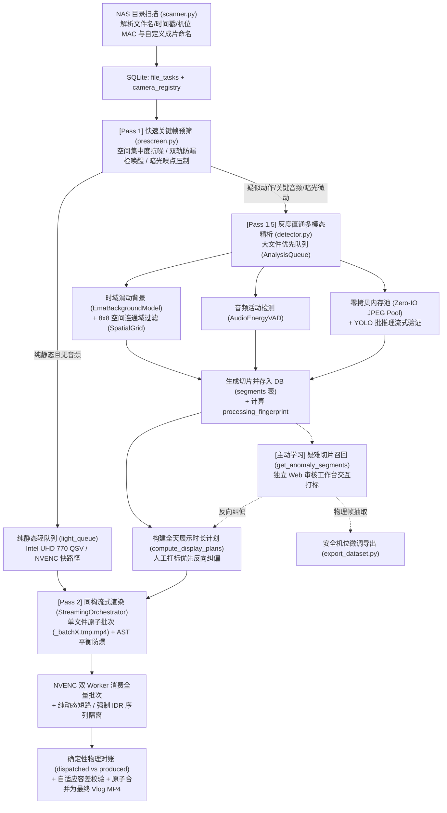

# HomeVlog 系统架构、数据契约与架构决策全景 (System Architecture & ADRs)

本文档为 HomeVlog 系统的**架构单一真实来源 (Single Source of Truth)**，严格对照生产代码实现编写，包含系统流水线拓扑、数据契约、硬件并发调度规约以及历次关键架构决策（ADR）。

---

## 一、系统架构总览

HomeVlog 的核心工程哲学为：**单次解码 (Single-Pass)**、**零临时落盘 (Zero-IO)**、**容错重于完美** 以及 **确定性物理对账**。

---

## 二、核心数据契约与存储架构 (Data Contracts)

系统元数据统一持久化存储于 SQLite (`data/vlog.db`)，并配置 `timeout=15.0` 与 WAL 模式下的 `PRAGMA busy_timeout = 10000;` 保障多线程高并发安全：

1. **`file_tasks` 表 (素材任务清单)**:
   - 记录监控素材全局状态，字段包含 `filepath`, `cam_index`, `date`, `file_start_time`, `file_duration`, `prescreen_status`, `analysis_status`, `processing_fingerprint` 等。
   - **Lazy Metadata 铁律**: 禁止在 `scanner.py` 中执行任何阻塞式探测（如 ffprobe）；所有媒体时长与元数据均由 `prescreen.py` 或 `detector.py` 懒加载回填。

2. **`segments` 表 (细粒度切片关系表)**:
   - 彻底解耦存储素材的细分动作/静止切片，包含 `start_time`, `end_time`, `state` (`STATIC` / `DYNAMIC` / `DYNAMIC_AUDIO`), `max_energy`, `avg_confidence`, `manual_label`, `review_reason` 等。
   - `get_all_file_tasks_for_date()` 采用单次批量预加载查询（Batch Prefetch），消除 $N+1$ 性能雪崩；`get_file_task_summary()` 提供微秒级主键单行读取。

3. **`human_reviews` 与 `camera_registry` 表**:
   - `human_reviews`: 按物理路径与原始时间区间永久记录人工打标事实，算法重跑时不被冲掉。
   - `camera_registry`: 维护摄像头物理 MAC 地址到逻辑机位编号与友好别名（如 `baby_room`）的确定性映射；配合 `resolve_output_filename` 原生支持成片命名模板高度自定义（`{date}`, `{mac}`, `{camera}`, `{index}`）。

4. **处理指纹契约 (`processing_fingerprint`)**:
   - 包含素材文件大小、mtime、检测参数、VAD 配置、分段阈值、YOLO 权重版本。
   - 指纹不符或配置更新时触发 `invalidate_stale_results()` 重置分析，但保留人工事实。

---

## 三、硬件调度与并发铁律 (Hardware Discipline)

1. **多级并发信号量 (`src.scheduler`)**:
   - `get_nv_semaphore()`: 上限 2，独显并发硬门限（RTX 3060Ti 8GB 显存与单 NVENC 单元的安全边界）。
   - `get_qsv_semaphore()`: 上限 8，核显并发槽位（Intel UHD 770 算力解耦）。
   - `get_disk_semaphore()`: 上限 32，全局 I/O 预算，防止大量并发把 NAS 打满。
   - **信号量释放单次原则**: `io_sem.release()` 必须且仅在 `finally` 块中执行一次，禁止提前释放或重复释放导致计数膨胀。

2. **显存安全水位线与自适应借调 (`WorkStealingManager`)**:
   - 实时探测 RTX 3060Ti 物理显存占用。超过 `vram_watermark_mb: 6200` 时，强制禁止 NVDEC 协同解码借调，确保 YOLO 推理和 NVENC 渲染拥有足够的显存裕量。

3. **子进程注册与优雅退出 (`FFmpegProcessRegistry`)**:
   - 所有 FFmpeg 子进程必须通过 `FFmpegProcessRegistry.register()` 注册并在 `finally` 块注销。
   - 用户触发 Ctrl+C 中断时，`kill_all()` 瞬间切断所有子进程，释放 GPU 会话，杜绝孤儿进程与显存泄露。

---

## 四、展示时长计划与时间轴规范 (Timeline Discipline)

1. **单一真相来源**:
   - `timeline.compute_display_plans()` 为渲染滤镜图与 SRT 字幕生成的唯一真相来源。
   - 静态段以关键帧抽帧压缩，展示时长受压缩比与 `[min_static_display_duration, max_static_display_duration]`（0.3s~1.5s）严格钳制。

2. **平滑过渡 (Speed Ramping)**:
   - 静态段向动态段过渡时，注入 1.0 秒线性速度渐变（Speed Ramping）和 0.25 秒音频淡入淡出（Cross-Fade），杜绝突兀眩晕。

3. **时间轴绝对闭环与对账**:
   - `src/detector.py` 的分析返回值最后一帧必须严格等于 `start_offset + file_duration`。
   - `StreamingOrchestrator` 退出必须等待 `all_dispatched_event`，并完成派发批次（`dispatched_batch_ids`）与已落盘批次（`produced | terminal`）100% 对账闭环。

4. **滤镜图 AST 递归防爆与安全降级**:
   - 稀疏混合批次 `select` 滤镜采用时间区间融合（Coalescing）与二叉平衡树表达式构造，将 AST 深度从 100+ 压减至 5 层以内；碎片区间 > 30 时安全降级为常规全帧解码，彻底根除 FFmpeg 内存分配异常 (`Cannot allocate memory`)。

---

## 五、核心架构决策全集 (Architecture Decision Records)

### ADR 0001: 单次硬件解码灰度直通与零拷贝候选池流转
- **状态**: Accepted (已采纳)
- **背景**: 家庭监控录像全天素材多达 140+ 文件，旧版存在预筛多次 Seek、RGB 解码后 CPU 重复转灰度、YOLO 二次解码、零碎图片频繁写盘等严重问题，单日耗时突破 60 分钟。
- **决策**:
  1. **解码管道灰度直通**: 底层通过 PyAV / FFmpeg 硬件加速直接输出 `-pix_fmt gray` 单通道灰度流（分辨率如 416x234），映射为单通道 `np.ndarray`，彻底消灭 CPU 色彩空间转换。
  2. **零落盘内存候选池 (Zero-IO)**: 对疑似运动帧在内存中通过 `cv2.imencode(".jpg", ...)` 压缩，以 `{frame_idx: bytes}` 字典形式流转，受 256MB 内存上限保护，YOLO 直接从内存解码批推理。
  3. **时域滑动 EMA 双差分**: 灰度流直接进入 `EmaBackgroundModel`，结合 8x8 空间连通域完成初筛。
- **影响**: NAS 单文件读取次数降为 1 次，分析帧吞吐提升 3.5 倍以上，单日分析壁钟压缩至 10 分钟以内。

---

### ADR 0002: 同构硬件渲染、参数集对齐与并发隔离
- **状态**: Accepted (演进定案)
- **背景**: 宿主机同时配备 Intel 核显（UHD 770）与 NVIDIA 独显（RTX 3060Ti）。早期设计曾尝试将静态轻批次分配给 QSV 编码，动态重批次分配给 NVENC 编码（即异构分配）。但在实际生产中发现：不同硬件编码器生成的 HEVC（H.265）VPS/SPS/PPS 参数集与像素格式（`nv12` vs `yuv420p`）存在底层二进制冲突。最终通过 `-c copy` 流拷贝合并时，MP4 容器仅保留首批次的参数集，导致播放器在跨批次切换点（如第二秒）解码器崩溃，丢弃后续上万帧，造成画面永久卡死。
- **决策**:
  1. **同构渲染铁律 (`render_gpu_policy: "nv_only"`)**: 生产环境渲染批次 100% 统一由 RTX 3060Ti 的 NVENC 硬件编码器处理，严格保持统一的分辨率、像素格式（`yuv420p`）与 SPS/PPS 参数集。
  2. **强制 IDR 序列隔离**: 在 NVENC 编码参数中显式追加 `"-forced-idr", "1"`，保证批次首帧与 GOP 关键帧均为自包含的 IDR 帧，杜绝跨批次参考错位。
  3. **双并发信号量隔离**: 通过 `get_nv_semaphore()` 控制 2 路 NVENC 并发槽位，结合 `WorkStealingManager` 在渲染启动时主动让步 NVDEC 解码，预留 6200MB 显存安全裕量。
- **影响**: 彻底根除了成片在批次切换点画面卡死的物理缺陷；得益于第 7 代 NVENC 的双引擎高吞吐，纯静态批次压制仅需 1~2 秒，单日 103 个批次总渲染耗时由 35 分钟压缩至 18 分钟以内。

---

### ADR 0003: 人机协同主动学习与审核工作台闭环
- **状态**: Accepted (已采纳)
- **背景**: 复杂家庭场景下的光影突变、红外噪点与微弱动态易造成传统 CV 算法误报或漏检，单纯调阈值会导致漏检关键事件。
- **决策**:
  1. **5 类疑难切片主动召回**: 系统自动从海量切片中挖掘 `fp_suspect`（无置信度高能量）、`fn_suspect`（临界微动）、`multimodal_conflict`（音画冲突）、`borderline_confidence`（临界置信度）、`jitter`（状态突变）。
  2. **独立 Web 审核工作台 (`scripts/audit_tool`)**: 原生轻量服务提供双轨时间轴视图（算法轨 vs 人工轨）、高保真抽帧比对与即时增量重浓缩引擎（`ReRenderManager`）。
  3. **人工打标绝对优先**: 在 `timeline.py` 中，人工标签（`manual_label`）优先级严格高于算法状态，纠偏后即时生效。
  4. **负样本安全微调**: 导出机位训练集（`export_dataset.py`）时强制包含纯静态（TN）与误报（FP）作为负样本，微调训练（`train_yolo.py`）强制冻结骨干网络（`freeze=10`），杜绝模型产生泛化虚警。
- **影响**: 建立了从算法判定到人工修正、再到模型微调的数据闭环，保证系统在特定家庭机位下越用越准。

---

### ADR 0004: 流式原子批次渲染、速度平滑过渡与时间轴闭环
- **状态**: Accepted (已采纳)
- **背景**: 整日 24 小时大视频单次压制风险极高，中途断电即前功尽弃；动态与静态过渡生硬跳跃会导致眩晕感；时间戳计算不闭环会引发跳秒黑帧。
- **决策**:
  1. **单文件原子批次**: `render.batch_max_files: 1` 确保每路渲染仅持有一个解码上下文；通过 `_batchX.tmp.mp4` 临时文件原子写入并校验大小，通过后重命名为正式批次。
  2. **断点续跑零损耗**: `cleanup_temp_artifacts(clean_batches=False)` 默认保留有效批次，随时中断随时秒级恢复。
  3. **展示时长计划唯一源**: `timeline.compute_display_plans()` 为滤镜图与 SRT 字幕的单一来源；静态段向动态段过渡注入 1.0s Speed Ramping 渐变与 0.25s 音频淡入淡出；通过 `src_offset_at_display()` 逆映射还原真实墙钟时间。
  4. **严格时间轴闭环与对账**: `detector.py` 最后一帧时间戳严格闭合到 `start_offset + file_duration`；`StreamingOrchestrator` 退出必须完成派发与落盘批次的 100% 对账校验。
- **影响**: 具备极强的抗中断能力；成片具有流畅自然的平滑过渡与精准墙钟映射；杜绝了渲染空洞与丢批。

---

### ADR 0005: 渲染并发门限对齐、受控 NVDEC 借调与强类型任务契约
- **状态**: Accepted (已采纳)
- **背景**: 生产遥测暴露三大物理瓶颈：① 渲染 Worker 线程数（3）与 NV 硬件并发信号量门限（2）超配，导致线程自旋排队并频繁触发 30s 超时退避（单日信号量空转等待高达 15~22 分钟）；② 精细分析阶段 99.8% 耗时为视频解码，而 QSV 单核硬解承担了全部并发，独显 NVDEC 解码器与近 3GB 显存闲置；③ 阶段间使用松散字典传递状态，预筛与分析阶段曾因默认值发生状态覆盖导致音频静音。
- **决策**:
  1. **并发门限 1:1 硬性对齐**: 将 `render.max_concurrency` 严格收敛为 2，与 `hardware.max_nv_concurrency: 2` 保持一致，彻底杜绝渲染线程抢夺信号量导致的超时退避与上下文切换开销。
  2. **激活受控 NVDEC 协同借调 (`nvdec_cooperative: true`)**: 在 `WorkStealingManager` 框架下，当分析队列积压超过高水位线且无活跃渲染任务时，允许借调至多 1 路 NVDEC 协同抽干积压队列；借调过程受 `vram_watermark_mb: 6200` 动态显存水位与渲染启动即时让步机制（`register_render_start`）双重安全保护。
  3. **强类型不可变任务契约 (`PipelineTask`)**: 废除不可控的裸 `dict` 传递，定义 `@dataclass PipelineTask` 作为贯穿预筛、分析与渲染阶段的单一契约载体，集成状态校验、强类型转换与自愈保护；并在分析完成向渲染派发时直通结构化 `is_heavy` 标识，消除渲染管理器频繁读取反序列化 SQLite 的重复锁开销。
- **影响**: 彻底消除渲染端每日 15~22 分钟的无谓信号量自旋等待，批次渲染耗时缩短 24%~31%；精细分析阶段积压出清速度提升；全链路任务流转数据契约得到严格类型保障，根除了元数据不同步隐患。

---

### ADR 0006: 成片命名模板高度自定义、夜视空间抗噪与流式渲染健壮性加固
- **状态**: Accepted (已采纳)
- **背景**: ① 成片命名硬编码为固定格式，无法满足用户对物理 MAC 地址 (`{mac}`)、语义机位别名 (`{camera}`) 及自定义模板的热修改需求，且独立审核工作台重浓缩模块存在命名硬编码缺陷；② 夜间暗光环境下红外补光灯引入的弥漫性高频白噪点在差分算法中极易产生伪运动误判，导致纯静态长视频流入精细分析重队列，而单纯提高均值门限又会导致远景或边缘小动作漏检；③ 在极端长视频或高频切片（如单个批次超过 100 个片段）场景下，FFmpeg 的 `select` 滤镜加法链会导致表达式语法树深度过深（AST Stack Overflow，引发 Code 4294967284 / Cannot allocate memory）；④ 监控录像切片末尾常因物理丢包或截断提前数秒 EOF，此前严格的容器时长检查容易误将有效批次误判为坏片并删除重试。
- **决策**:
  1. **高度自定义成片命名模板**: 引入核心函数 `resolve_output_filename()`，支持 `{date}`, `{mac}`, `{camera}`, `{index}` 四大占位符，支持用户在 `settings.yaml` 中随时修改模板（默认 `DailyVlog_{date}_{mac}.mp4`），并提供语义别名向 MAC、MAC 向逻辑编号的平滑级联降级；并在主流程与审核工作台重浓缩引擎全面接线消费。
  2. **低照度空间集中度抗噪与双轨防漏检（路径 1）**: 在 `prescreen.py` 中对暗光环境（`mean_luma < 50.0`）启用空间能量集中度硬拦截（`concentration >= 1.25` 且局部块有效能量达标），过滤弥漫型白噪点；同时引入单点局部能量突破分支（`max_cell_energy >= max(14.0, threshold * 2.2)`），确保远景与边缘小目标运动 100% 唤醒（保持零漏检、零虚警）。
  3. **AST 递归防爆与二叉平衡树构建**: 在 `timeline.py` 中，对稀疏混合批次的时间区间实行预融合（Coalescing）；当碎片区间 `<= 30` 时采用二叉平衡树递归构建 `select` 表达式，将 AST 深度从 100+ 骤降至 5 层以内；当碎片区间 `> 30` 时安全降级为常规全帧解码，根除 FFmpeg 内存分配异常。
  4. **容器合法性自适应容差与 SQLite 并发加固**: 将 `valid_video` 的长视频容差放宽至 `max(5.0, expected * 0.11)` 并提供结构化诊断日志；在 SQLite 连接中配置 `timeout=15.0` 与 `PRAGMA busy_timeout = 10000;`，防御多 Worker 瞬时写入锁争用；在 `detector.py` 严格对齐 `ultra_long` 等各档位配置分支。
- **影响**: 实现了成片命名的灵活热重载与全链路统一；夜间纯静态素材识别耗时压缩 98% 以上且保持 100% 召回底线；大片段批次渲染彻底杜绝 AST 爆栈崩溃；消灭了有效视频批次的误删与 SQLite 锁竞争异常。
