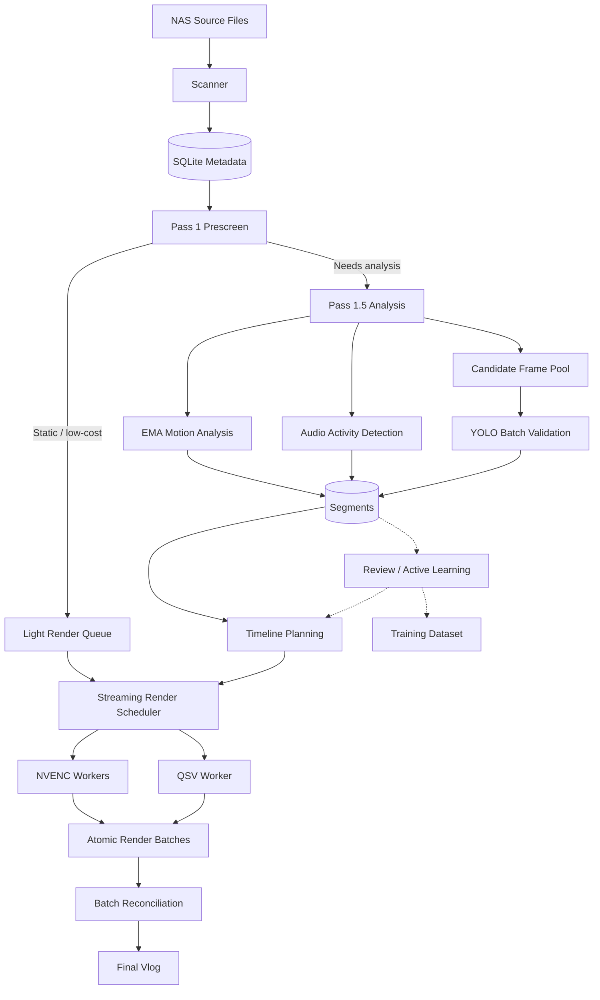
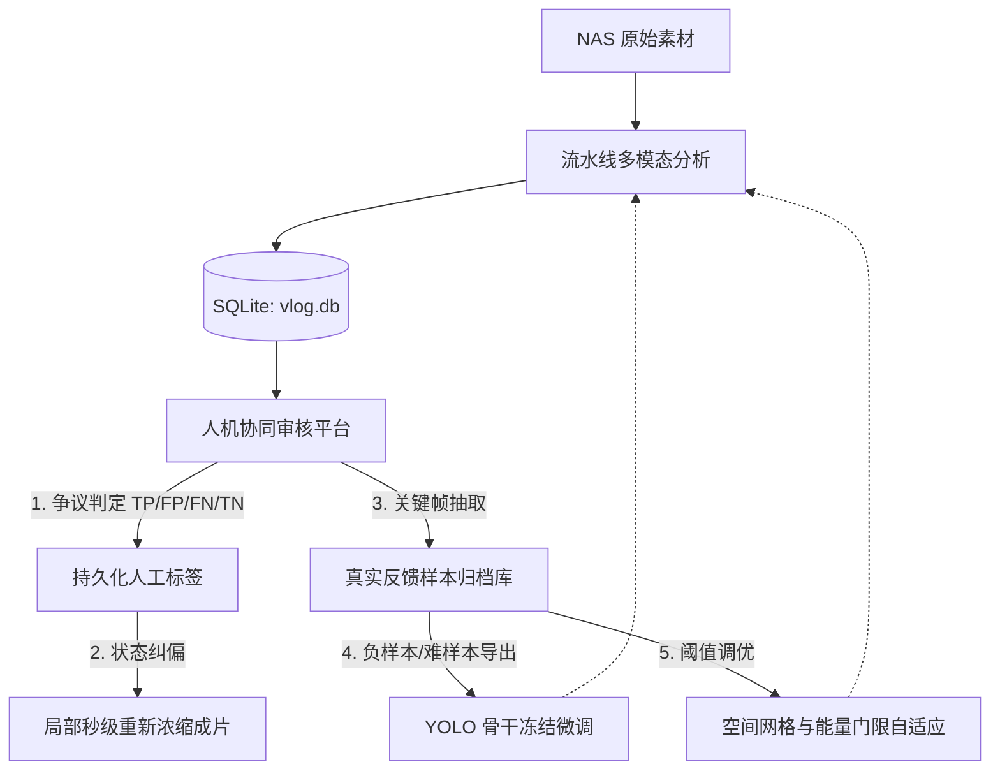

# HomeVlog Architecture

本文档描述 HomeVlog **当前有效的系统架构、数据契约、模块边界与关键运行时不变量**。

它回答：

> 系统现在如何工作，以及哪些架构约束不能被局部修改破坏。

历史架构决策与演进原因记录于：

```text
docs/DECISIONS.md
```

测试策略、质量验收准则与硬件隔离测试记录于：

```text
docs/TESTING.md
```

当前开发状态、生产基线遥测与已知问题记录于：

```text
docs/PROGRESS.md
```

---

# 1. Architecture Principles

HomeVlog 面向长时间家庭监控素材，将全天录像分析、筛选并浓缩为可观看的 Vlog。

架构设计遵循以下核心原则。

## 1.1 Single-Pass Decode

同一阶段内应尽可能复用一次解码产生的数据，避免为运动分析、YOLO 验证等消费者重复执行完整视频解码。

新的分析消费者优先接入现有分析数据流，而不是独立重新读取和解码源媒体。

---

## 1.2 In-Memory Intermediate Data

分析阶段产生的候选帧优先以内存压缩表示流转。

当前候选帧采用 JPEG bytes 形式保存在受限内存池中，并直接供后续 YOLO 批推理消费。

除最终产物、持久化训练样本及事务性渲染批次外，不应依赖零碎临时图片作为流水线阶段间接口。

---

## 1.3 Fault-Tolerant Processing

NAS 网络抖动、源视频损坏、Seek 失败和提前 EOF 均属于预期运行条件。

局部失败原则上应：

```text
detect
→ record diagnostics
→ isolate failed unit
→ degrade or skip safely
→ continue pipeline
```

但任何可能破坏以下性质的异常不得静默忽略：

- 时间轴完整性；
- 批次完整性；
- 最终输出可播放性；
- 数据库状态一致性。

---

## 1.4 Deterministic Output

分析结果、展示时长、字幕、渲染批次和最终输出必须能够从相同输入状态确定性重建。

系统不得依赖未持久化的隐式会话状态决定最终时间轴。

---

## 1.5 Resumable Execution

长时间任务应以可验证、可恢复的工作单元推进。

渲染批次是独立事务单元：

```text
render temporary output
→ validate
→ atomic promote
→ persist completion
```

有效批次在普通重启或清理流程中不得被删除。

---

# 2. System Pipeline



整个流程可以划分为五个逻辑阶段：

1. Discovery & Metadata
2. Prescreen
3. Analysis
4. Timeline Planning
5. Rendering & Finalization

---

# 3. Persistent Data Model

系统持久状态统一存储于：

```text
data/vlog.db
```

SQLite 运行于 WAL 模式，并配置连接与锁等待策略以支持多 Worker 并发访问。

数据库是跨进程、跨会话状态的主要持久化来源。

---

## 3.1 `file_tasks`

记录源媒体级任务状态。

主要职责包括：

- 文件路径；
- 摄像头身份；
- 日期和文件起始时间；
- 媒体时长；
- Prescreen 状态；
- Analysis 状态；
- Processing Fingerprint。

### Metadata Contract

Scanner 只负责低成本文件发现与可直接从路径或文件系统获得的信息。

`src/scanner.py` 不负责昂贵的媒体探测。

媒体时长等需要解码或媒体解析才能获得的信息，应在后续分析阶段懒加载并持久化。

---

## 3.2 `segments`

记录源媒体内部的时间区间及其语义。

典型字段包括：

```text
start_time
end_time
state
max_energy
avg_confidence
manual_label
review_reason
```

核心状态包括：

```text
STATIC
DYNAMIC
DYNAMIC_AUDIO
```

Timeline 层消费 `segments`，而不是重新执行运动分析。

---

## 3.3 Human Review State

人工判断属于独立持久事实，不应因为算法重新分析而丢失。

算法结果可以失效和重新生成，但人工反馈必须跨重新分析保留。

Timeline 重建时：

```text
human decision > algorithmic decision
```

---

## 3.4 Camera Registry

`camera_registry` 维护：

```text
physical MAC
↕
logical camera index
↕
semantic alias
```

所有输出文件命名必须通过统一的命名解析逻辑完成。

禁止不同子系统自行复制输出文件命名规则。

---

# 4. Processing Fingerprint

`processing_fingerprint` 用于判断已有分析结果是否仍然适用于当前输入和配置。

Fingerprint 应覆盖会影响分析语义的输入，例如：

- source file size；
- source mtime；
- detection parameters；
- VAD configuration；
- segmentation parameters；
- model / weights version。

Fingerprint 改变时，可以失效算法生成的数据。

人工事实不得被自动失效。

---

# 5. Prescreen Architecture

Prescreen 的职责是以远低于完整分析的成本完成第一阶段筛选。

目标是：

```text
obviously static
        ↓
avoid expensive analysis

possibly meaningful
        ↓
full multimodal analysis
```

Prescreen 不应承担最终语义判断。

---

## 5.1 Low-Light Noise Handling

低照度环境中，红外噪点可能产生大面积随机差分。

Prescreen 使用空间能量分布而不仅是全局平均差分判断运动。

当前实现包含：

- spatial concentration filtering；
- local high-energy wake-up path；
- low-light-specific thresholds。

设计要求：

> 抑制弥漫性随机噪声时，不得依赖单纯提高全局运动阈值而显著降低真实小目标召回。

具体参数属于配置和实现细节，不作为架构契约。

---

# 6. Analysis Architecture

需要进一步判断的素材进入 Analysis Pipeline。

核心数据路径为：

```text
decoded grayscale frame
        │
        ├── EMA background model
        │
        ├── SpatialGrid
        │
        ├── AudioEnergyVAD
        │
        └── Candidate Frame Pool
                 ↓
             YOLO batch
```

---

## 6.1 Grayscale Analysis Contract

运动分析管道使用单通道灰度帧。

输出尺寸契约为：

```text
width × height
```

而不是：

```text
width × height × 3
```

不要在 FFmpeg / decoder 输出 RGB/BGR 后再执行 CPU 灰度转换，除非新的实现经过明确基准验证并更新相关架构决策。

阈值算法的规范输入是 8 位全范围灰度。只有 PyAV `gray` 帧可直接读取平面；limited-range YUV、10 位 YUV 和 RGB 必须经共享 `video_frame_to_gray()` 转换，Prescreen 与 Analysis 不得维护不同的像素解释。

scanner 写入的文件名跨度只是名义时长。只有实际打开媒体容器后才可设置 `duration_verified=1`；未验证时长不能用于跳过媒体探测。

---

## 6.2 Candidate Frame Pool

只有满足候选条件的帧进入 YOLO 验证。

候选帧：

1. 在内存中压缩；
2. 受内存预算限制；
3. 批量送入 YOLO；
4. 不通过中间临时图片文件交换。

---

## 6.3 Adaptive Analysis FPS

分析实际 FPS 可以根据素材长度或运行时策略动态调整。

依赖帧序号进行后续采样或验证的代码必须使用解码器实际采用的：

```text
effective_fps
```

不得假设静态配置值等于实际分析帧率。

---

## 6.4 Analysis Scheduling

Analysis Queue 采用短作业优先策略，使较短素材能够尽早生成可渲染任务并保持下游 GPU 有持续工作来源。

当前排序主要依据：

```text
file_duration
```

架构目标不是简单缩短单个分析任务，而是降低整个 Pipeline 的 downstream starvation。

---

# 7. Hardware Resource Model

HomeVlog 同时利用：

```text
RTX 3060 Ti
├── NVENC
└── NVDEC

Intel UHD 770
└── QSV

NAS
└── shared I/O budget
```

这些资源由统一 Scheduler 管理。

业务模块不得自行创建另一套独立硬件并发控制体系。

---

# 8. Scheduler and Concurrency

主要调度入口位于：

```text
src.scheduler
```

---

## 8.1 Resource Semaphores

当前资源模型包括：

```text
NVENC semaphore
NVDEC semaphore
QSV semaphore (Analysis)
QSV render semaphore (Render Worker Exclusive)
Disk I/O semaphore
```

NVENC 与 NVDEC 被视为独立硬件资源，不再通过单一 NV semaphore 串行化。

QSV 硬件资源实行阶段间物理槽位隔离（ADR 0014）：
- `get_qsv_render_semaphore()`: 独占槽位（上限 1），专供 `qsv_0` 渲染 Worker 使用，不受分析阶段并发挤占；
- `get_qsv_semaphore()`: 分析阶段共享槽位，上限自动收敛为 `max(1, max_qsv_concurrency - 1)`，根除跨阶段硬件租约饥饿与排队告警。

`get_nv_semaphore()` 仅承担兼容性职责，不应作为新的通用 NV 资源模型继续扩展。

具体并发数量属于当前硬件配置，应由配置与 Benchmark 共同决定，而不是在业务代码中重复硬编码。

---

## 8.2 Semaphore Ownership

获得信号量的代码负责释放该信号量。

释放必须具有 exactly-once 语义。

标准模式：

```python
acquire()
try:
    ...
finally:
    release()
```

禁止：

```text
release before return
+
release again in finally
```

因为这会破坏并发计数并最终导致资源门限失效。

---

## 8.3 Work Stealing

渲染任务按实际渲染成本进行异构调度。

主要目标：

```text
NVENC → heavy work
QSV   → light / moderate work
```

Scheduler 可以根据：

- queue depth；
- estimated dynamic duration；
- active analysis load；
- remaining tail work；

动态决定 QSV 是否窃取任务。

具体阈值属于调优参数，不构成永久架构契约。

---

## 8.4 Tail Guard & Dynamic Steal Balancing

临近任务结束时，应避免较慢 Worker 接手可能形成长尾的任务，同时杜绝过早退出导致尾部饥饿。

Tail Guard 遵循自适应平衡原则：
- **退出守卫**：QSV 仅当重任务队列真正为空，或者剩余排队任务数 $\le$ 活跃 NV 工人数时退出，避免过早退出让出轻中量任务；
- **动态门限放宽**：当所有 NVENC 工人均处于忙碌状态且重任务队列仍有积压时，动态将 QSV 窃取门限放宽 1.5×（例如由 420s 放宽至 630s），允许 QSV 分担适度中量任务；
- **最终收尾**：当仅剩极少量重任务且已有活跃 NV 工人覆盖时，QSV 优雅退出，由高速 NVENC 完成最终收尾。

其目标是最小化：

```text
makespan
```

实现毫秒级多工同步收尾，而不是最大化单一硬件的局部工时。

---

# 9. FFmpeg Process Lifecycle

所有长时间运行的 FFmpeg `Popen` 子进程必须受到统一生命周期管理。

使用：

```text
FFmpegProcessRegistry
```

完成：

```text
spawn
→ register
→ run
→ deregister in finally
```

Ctrl+C 或全局终止时：

```text
kill_all()
```

必须能够释放仍在运行的 FFmpeg 进程及其 GPU 会话。

不得创建绕过 Registry 的后台 FFmpeg Worker。

---

# 10. Timeline Architecture

Timeline 层负责把分析得到的源时间区间转换为最终展示时间轴。

Timeline 不负责重新分析视频内容。

---

## 10.1 Display Plan as Single Source of Truth

展示计划显式接收输出帧率，每段目标向上量化到整数帧。视频 `trim=end_frame` 与音频目标同钟；字幕、高光、批次校验均传入相同 fps。每段最多增加不足一帧的尾部展示时间，避免音视频 concat 按较长轨道推进产生未计入计划的累积偏差。

音频按目标样本数 `atrim=end_sample` 闭合，不能仅按源 PTS 时长截断后重排时间戳，否则摄像机重叠 PTS 会留下多余样本。最终 ffconcat 使用每批视频 duration；视频保持 stream copy，音频重新对齐 PTS 后编码，避免 AAC 延迟/尾部填充制造视频接缝空洞与音频 DTS 回退。

展示计划唯一权威入口：

```text
timeline.compute_display_plans()
```

以下模块必须消费同一份 Display Plan：

```text
Render filter generation
SRT generation
Wall-clock mapping
```

不得分别实现自己的展示时长计算。

流式批次与伴随资产均使用 `build_timeline_from_rows(..., resolve_presence=False)`：按文件独立构造，保留人工纠正，不重新进行跨文件 presence 分类/合并。伴随资产生成只读数据库。重叠区间归一化由 timeline 共用实现按文件独立处理；变速过渡不跨源文件边界，避免批次大小影响展示计划。

---

## 10.2 Human Override

时间轴生成时，人工标签优先于算法判定。

例如：

```text
FP
→ force static

FN
→ force dynamic
```

人工纠正必须能够在重新运行 Timeline 时稳定复现。

---

## 10.3 Source / Display Time Mapping

系统同时存在：

```text
source timeline
display timeline
wall-clock timeline
```

三者不能混用。

从最终展示时间反查源视频位置必须通过统一逆映射：

```text
src_offset_at_display()
```

字幕真实时间也应通过同一映射体系生成。

---

## 10.4 Timeline Closure

每个源视频分析形成的时间范围必须完整覆盖预期媒体范围。

最后一个分析边界必须闭合到：

```text
start_offset + file_duration
```

以避免：

- timeline holes；
- missing frames；
- subtitle discontinuity；
- render gaps。

---

## 10.5 Dual-Track Timestamp Mapping Contract

系统跨模块消费时间时，必须严格遵守绝对时间、文件相对时间与墙钟时刻的双轨换算契约：

| 维度 | 字段名称 | 物理基准点 | 典型取值 | 业务消费场景 |
| :--- | :--- | :--- | :--- | :--- |
| **日内绝对时间** | `start_time` / `end_time` | 当天 `00:00:00` 起算的绝对秒数 | `65373.5s` (折合 18:09:33.5) | 24小时全局时间轴排序、拼接剪辑 (`concat`)、跨视频全局去重。 |
| **文件相对时间** | `local_t` | 单个物理文件 `0.0s` 起算的时间 | `259.5s` | 所有针对单文件的 FFmpeg 抽帧、PyAV 寻道、WebP 动图截取。 |
| **真实墙钟时间** | `clock_time` | 真实人类世界挂钟时分秒 | `18:09:33` | 界面刻度尺、标签徽标、SRT 字幕展示。 |

### 换算公式与寻道防御
$$\text{file\_offset} = \text{hour} \times 3600 + \text{min} \times 60 + \text{sec}$$
$$\text{local\_t} = \max\left(0.0, \min\left(\text{start\_time} - \text{file\_offset}, \text{file\_duration} - 0.1\right)\right)$$

寻道操作必须通过边界夹紧（Clamping）严格受控在媒体有效时长内，杜绝负向时间戳或末端溢出引发解码器挂起。

---

## 10.6 Five-Tier Adaptive Rate Contract (五级自适应阶梯浓缩模型)

为了根除将“有人静止陪伴”或“夜间睡眠微动作”粗暴当作纯静态抽帧丢弃导致的 P0 级严重漏检，同时避免成片被夜间熟睡过度膨胀（实测 62.3% 的驻留时间为夜间睡眠），系统确立了五级自适应浓缩契约：

| 状态标识 (`state`) | 播放倍速与呈现模式 | 触发与识别条件 | 适用场景与业务目标 |
| :--- | :--- | :--- | :--- |
| **`DYNAMIC`** / **`DYNAMIC_AUDIO`** | **1.0x 常速原画** (无损保全) | YOLO 置信度达标目标或音频能量触发 | 行走、抱起、走动互动、有声事件（核心高光） |
| **`PRESENCE`** | **4.0x 温和快进** (实体解码保留) | 白天两次活动事件间 $\le 180\text{s}$ 静止停顿，且具主体因果证据 | 家长看护坐定、静止陪伴、看书、看手机（防丢弃） |
| **`NIGHT_STATIONARY`** | **16.0x 高倍浓缩** (平滑变速过渡) | 夜间 23:00~07:00 睡眠静止或全天持续低能量 $\ge 180\text{s}$ 极低能量静止 | 夜间熟睡期、长时卧床休息（去虚胖，保留呼吸节奏） |
| **`MICRO_MOTION`** | **16.0x 巡航 + 3.0s 锚点** | 差分能量 $\ge 2.5$，YOLO 虽未框选但具有物理运动 | 夜间睡眠翻身、微弱手足活动、遮挡动作（事件保全） |
| **`STATIC`** | **55.0s 抽 1 帧** (幻灯片快进) | 差分能量 $< 2.5$，无人无声，深度睡眠静止 | 纯静态空房间背景、深夜平稳深度睡眠期（极限浓缩） |

### 跨文件时序因果链传递 (Cross-File Presence Propagation)
监控录像通常每 5~10 分钟切分为独立物理文件。若仅在单文件内检测，处于文件首尾的切片（如视频结束前坐定、下一段视频开头站立）会因边界截断被判定为静态丢弃。
因此，时间线构建必须在跨文件全局序列上执行 `resolve_presence_segments`，并在完成因果链状态传递后再通过 `split_segments_at_file_boundaries` 投影回各物理文件边界，确保 Virtual Concat 寻道绝对安全。

流式批次是例外：分析尚未完成时禁止执行跨文件 presence 重判，批次只使用已持久化的单文件分析状态，避免同一素材因邻居任务完成顺序不同而生成不同时间轴。跨文件 presence 仅在分析结果稳定后由全量时间轴构建路径执行。

### 渲染端活动实体集集合契约
```text
ACTIVE_STATES = {"DYNAMIC", "DYNAMIC_AUDIO", "PRESENCE", "NIGHT_STATIONARY", "MICRO_MOTION"}
```
所有属于 `ACTIVE_STATES` 的切片均进入实体音视频解码流，严禁将其作为静态抽帧忽略。

---

## 10.7 Filter Graph Duration Invariance and EOF Clamping (滤镜图时长硬截断不变量)

在非连续稀疏混合解码（`sparse_mixed`）或关键帧抽帧渲染模式下，输入视频流经 `select` 过滤器跳过了长时间静态区间。
此时，`trim=start=s:end=e` 滤镜在区间末端发射 EOF 时，其携带的流内 `eof_pts` 可能会直接跳跃至后续下一个被选中区间的起始时间戳。

**架构铁律**：
在 FFmpeg `concat=n=N:v=1:a=1` 滤镜图中，单段展示时长取 `max(video_duration, audio_duration)`。若非纯静态段后挂载 `fps` 滤镜，下游 `fps` 滤镜会依据外溢的跳跃 `eof_pts` 疯狂克隆末帧数十至数百次，导致批次实际展示时长严重超越计划时长并触发渲染丢弃。

因此，所有非纯静态段必须强制执行时长硬截断：
```text
tpad → fps → trim=duration={actual_display_dur:.3f} → setpts=PTS-STARTPTS
```
对应音频必须执行 `apad → atrim` 到同一展示时长。该规则覆盖 DYNAMIC、DYNAMIC_AUDIO、STATIC、PRESENCE、NIGHT_STATIONARY、MICRO_MOTION 及单动态快路径，保证源提前 EOF 时两轨都闭合到 `compute_display_plans` 的计划时钟。

---

# 11. Rendering Architecture

Rendering Pipeline 使用流式异构 Worker，而不是等待全天分析完全结束后再统一启动。

目标：

```text
analysis produces work
        ↓
render immediately consumes
```

从而让分析与渲染在可能情况下重叠。

---

## 11.1 Render Queue Model

任务根据成本大体分为：

```text
light work
heavy work
```

当前 Scheduler 使用双端任务获取策略：

```text
NVENC
→ prefer heaviest work

QSV
→ prefer static
→ otherwise steal lightest eligible work
```

任务成本应基于需要实际渲染的动态时长，而不是简单采用源文件总时长。

---

## 11.2 Worker Exit Semantics

队列中的 sentinel 只承担 Worker 唤醒或状态传播用途。

Worker 不得因为单独读取到 sentinel 就立即退出。

退出必须同时满足：

```text
all work dispatched
AND
heavy queue empty
AND
light queue empty
```

否则可能遗漏另一队列中仍未消费的任务。

---

# 12. Atomic Render Batches

每个渲染批次首先写入临时文件：

```text
_batchX.tmp.mp4
```

完成后至少验证：

- process exit status；
- output existence；
- output size；
- required media validity checks。

验证成功后再执行原子替换：

```text
_batchX.tmp.mp4
        ↓
_batchX.mp4
```

只有正式批次可以进入最终合并流程。

---

# 13. Render Completion Barrier

“所有任务已经派发”不等价于“所有任务已经完成”。

StreamingOrchestrator 必须区分：

```text
dispatch complete
render complete
```

最终阶段必须等待所有渲染 Worker 完成，并执行批次对账。

核心不变量：

```text
dispatched batches
==
produced batches ∪ terminal batches
```

任何无法解释的缺失批次均属于完整性错误。

主动取消由 abort_event 明确区分，保存已完成批次与 cancelled 遥测，不将尚未完成批次报告为静默丢失；不得把 stop_event 当作取消，因为它也用于正常派发结束。

不得继续执行最终 merge。

---

## 13.1 Parallel Checkpoint Validation Contract

最终拼接阶段（`final_concat`）必须在产物原子重命名前验证每个批次连接处的解码完整性（`valid_video`）。

- **全量覆盖契约**：为杜绝异构编码在流切片接缝处出现不可观测的破损或丢帧，严禁在接缝处采用稀疏或随机抽样；
- **并行分块校验**：采用多线程（`ThreadPoolExecutor(max_workers=min(8, N))`）将全量接缝分块并行解码验证，各线程独立持有解码容器且内部 Seek 严格单向递增，确保在保障 100% 接缝无损的同时，将校验耗时压至磁盘 I/O 物理下限。
- **连续性契约**：串行与并行路径共用同一窗口校验，拒绝损坏帧、空 PTS、非单调 PTS 和超过 1.5 个帧周期的内部间隔；最终尾窗必须可解码。
- **交付契约**：渲染产物必须有音轨，视频/音频时长与 display plan 在最多两个输出帧周期（上限 0.5s）内一致。可打开容器不等于可提交产物。

最终完成标记是一个提交边界：视频校验、字幕与元数据原子写入、manifest 保存全部成功后，数据库才可进入 `COMPLETED`。恢复快路径必须同时验证媒体、manifest 和必需伴随资产。

---

# 14. Static Segment Fast Path

长纯静态区间不应按照普通动态视频执行完整逐帧渲染。

静态 Fast Path 应尽可能：

```text
select required frames
        ↓
scale / transfer
        ↓
encode
```

而不是：

```text
full decode
→ process every frame
→ discard most frames
```

这一路径是长时间监控视频压缩性能的关键优化之一。

具体触发阈值属于可调参数。

---

# 15. FFmpeg Filter Graph Safety

复杂时间区间可能生成过深的 FFmpeg `select` 表达式。

因此 filter expression 必须限制递归复杂度。

当前策略：

```text
time-range coalescing
        ↓
balanced expression construction
        ↓
complexity threshold
        ↓
fallback to full-frame decode
```

系统优先保证渲染成功，而不是无限追求稀疏解码优化。

---

# 16. Mixed Hardware Encoding

渲染可以同时使用：

```text
NVENC
QSV
```

批次最终通过 stream-copy 路径合并。

不同硬件编码产生的 HEVC 流必须满足最终容器与解码器兼容要求。

当前实现通过：

```text
consistent pixel format
+
in-band parameter-set injection
```

批次使用 `hev1` 保留带内参数集，避免 `hvc1` 封装剥离异构编码器重配置所需信息。最终原子提交前解码各拼接边界；失败不覆盖既有成片。边界检查不能替代全片解码与目标播放器验收。

QSV 以 `global_quality` 使用 ICQ，不混用 `maxrate/bufsize`。渲染接管素材时消费预取所有权；预取在已有源文件锁内复核，防止清理后迟到复制。

修改：

- codec；
- pixel format；
- encoder parameters；
- bitstream filter；
- final concat strategy；

任一项时，都必须重新验证跨硬件批次连续播放。

---

# 17. Active Learning Architecture

Active Learning 是独立于主处理路径的反馈闭环，用于通过人机协同裁决实现模型与参数的自进化。



---

## 17.1 Review Data and Override Contract

人工审核结果必须保存在独立持久字段（如 `segments.manual_label` 与 `human_reviews` 表），而不是直接覆盖算法原始特征分析值。

系统同时保留：
```text
algorithm predicted (algo_status, energy, confidence)
human corrected (manual_label, notes, review_timestamp)
```

时间轴重构时，遵循最高优先级覆盖法则：
- **`FALSE_ALARM` (FP) / `CONFIRMED_STATIC` (TN)**：在成片中强制降级为纯静态抽帧段，彻底滤除光影假阳性；
- **`MISSED_MOTION` (FN) / `CONFIRMED_MOTION` (TP)**：在成片中强制提升为常速动态段，挽救关键家庭瞬间。

---

## 17.2 Frame Archival

训练样本归档由统一 Frame Archiver 负责。

优先从源媒体抽取原始高清关键帧。

如果：
- source missing；
- seek failed；

可以降级使用内存池缓存帧。降级必须记录诊断信息，但不得因单个训练样本提取失败中断整个审核工作流。

---

## 17.3 Dataset Safety and Fine-Tuning Contract

针对家庭机位的主动学习微调必须遵守以下安全契约：

1. **正负样本平衡与空标注导出**：
   - 确认的有效动态段导出为 YOLO 标准归一化边界框与类别。
   - **强制负样本导出**：确认的纯静态段（TN）与误判段（FP）强制导出为空 txt 标注文件，使模型明确感知“空旷客厅/婴儿床”属于无目标背景，抑制假阳性扩散。
2. **冻结骨干网络微调 (`freeze=10`)**：
   - 专用机位微调脚本强制包含骨干网络冻结参数（仅更新检测头权重，冻结前 10 层通用特征提取网络）。
   - 严禁全量参数微调，防止小样本导致骨干通用特征退化与泛化虚警爆炸。

---

## 17.4 Anomaly Categories and Mining Rules

数据库层接口 `VlogDatabase.get_anomaly_segments()` 按照以下物理判定规则从海量切片中挖掘待审样本：

1. **疑似光影假动态 (`fp_suspect`)**：
   - 判定条件：`state == 'DYNAMIC'` 且 `avg_confidence == 0.0` 且 `max_energy < 8.0`。
   - 物理成因：日落斜射、车灯扫过地面或白平衡自适应跳变，引起大面积亮度变化但无真实目标。
2. **疑似动作漏检 (`fn_suspect`)**：
   - 判定条件：`state == 'STATIC'` 但能量接近门限或存在 `BORDERLINE_MICRO_MOTION`。
   - 物理成因：暗光红外下婴儿缓慢翻身或微小动作，差分能量处于临界值（3.5~5.0）。
3. **多模态声画冲突 (`multimodal_conflict`)**：
   - 判定条件：视频画面为 `STATIC`，但音频分析触发 `DYNAMIC_AUDIO`（哭声、咳嗽、落地碰撞）。
   - 物理成因：画外音、盲区声音事件或空调底噪瞬态突变。
4. **置信度临界 (`borderline_confidence`)**：
   - 判定条件：YOLO 目标置信度徘徊在判定门限边缘（0.25 ~ 0.35）。
   - 物理成因：远距离极小目标、重度遮挡或姿态异常人体。
5. **极短状态抖动 (`jitter`)**：
   - 判定条件：切片时长 $< 2.0\text{s}$ 且与前后切片状态频繁翻转。
   - 物理成因：树影晃动或光照临界频繁震荡。

---

## 17.5 Audit Service API Contract

审核工作台后台提供轻量 RESTful API 契约（`scripts/audit_tool/app.py`）：

- **`GET /api/overview`**：获取已审进度、TP/FP/FN/TN 统计计数以及实时 Precision / Recall 指标。
- **`GET /api/anomalies`**：获取按类别（`fp_suspect`, `fn_suspect`, `jitter`, `reviewed`）过滤及能量排序的争议切片队列。
- **`GET /api/file_segments`**：获取单视频全量时序切片元数据及审核状态。
- **`GET /api/frame`**：单帧提取接口，支持 `w=640` 缩略图与 `w=1920` 超高清原画，素材离线时返回占位图兜底。
- **`POST /api/yolo_detect`**：按需对指定峰值时刻运行目标检测并返回边界框与置信度。
- **`POST /api/review`**：提交人工裁决，合法标签：`CONFIRMED_MOTION` (TP) | `FALSE_ALARM` (FP) | `MISSED_MOTION` (FN) | `CONFIRMED_STATIC` (TN)。
- **`GET /api/export`**：导出带 UTF-8 BOM 的分析报表（CSV / JSON 格式）。
- **`POST /api/rerender` / `GET /api/rerender_status`**：异步触发秒级局部重新浓缩成片并轮询压制状态机。

服务仅接受 loopback Host 与同源 Origin。页面首次加载取得随机 `HttpOnly`、`SameSite=Strict` 令牌 cookie，所有写请求必须携带该令牌；媒体参数只允许数据库已登记路径并限制请求体及数值范围。

审核重渲染默认要求全部源文件可访问，使用只读逐文件 timeline 与实际渲染行快照生成伴随资产。单任务取消只设置本任务令牌，不得触发全局 FFmpeg 中断。

---

# 18. Configuration Contract

`config/settings.yaml` 是用户可配置运行行为的入口之一。

配置必须满足：

```text
configuration
↕
runtime implementation
```

双向一致。

禁止存在：

```text
defined but unused key
```

或：

```text
runtime branch with undocumented configuration semantics
```

Preset / tier 等枚举配置必须具有明确的代码消费逻辑。

---

# 19. Performance Measurement Contract and Hardware Baselines

并行系统的性能指标评估必须遵守清晰的量纲与基线契约。

---

## 19.1 Worker Time vs Wall-clock Time

- **Worker Time**：所有 Worker 实际工作时长的累计值，用于定位各子系统 CPU/GPU 算力开销与负载分布。
- **Wall-clock Time**：用户从任务启动到成片交付实际等待的真实壁钟时间，是端到端优化的终极衡量依据。

两者的比值直接体现硬件流水线与异构 Worker 的并行度。

---

## 19.2 Standard Hardware Baseline Environment

HomeVlog 的性能调优与资源限额锚定在标准生产硬件拓扑：

- **CPU**: Intel Core i5-12600K (6P + 4E, 16 线程全负载调度)
- **核显 (iGPU)**: Intel UHD Graphics 770 (双 Gen12 VDBox，专职 QSV 解码与动态批次反向工作窃取)
- **独显 (dGPU)**: NVIDIA GeForce RTX 3060Ti (8GB GDDR6，专职 YOLO 批推理与双路 NVENC 硬件编码)
- **输入介质**: NAS SMB 共享目录 / 本地 4K H.265 监控视频 (24 小时约 86,400s，日均 140~144 个 MP4，约 40GB~60GB)
- **运行环境**: Windows 11 (PowerShell 5.1+, Python 3.12, PyTorch CUDA 12.4, uv)

---

## 19.3 Core Operator & Model Latency Baselines

在标准环境下的基础算子与模型微观吞吐基准：

| 算子 / 模型 | 输入规格 | 单次耗时 | 显存占用 | 吞吐能力 |
| :--- | :--- | :--- | :--- | :--- |
| **空间集中度预筛选** | 80x45 差分图 (4x4 网格) | **0.04 ms** | 0 MB | > 25,000 fps (CPU 向量化) |
| **EMA 滑动背景更新** | 80x45 单通道灰度 | **0.08 ms** | 0 MB | > 12,000 fps |
| **AudioEnergyVAD** | 50ms PCM 音频片段 | **0.02 ms** | 0 MB | > 50,000 fps |
| **YOLOv11n (2.6M)** | 416x234 RGB (Batch=4) | **14.2 ms** (3.55ms/帧) | ~269 MB | ~280 fps |
| **YOLOv11m (20.1M, 默认)** | 416x234 RGB (Batch=4) | **28.6 ms** (7.15ms/帧) | ~920 MB | ~140 fps (高精防漏检) |

---

## 19.4 Physical Hardware Constraints & Invariants

1. **GA104 单 NVDEC 引擎的并发硬顶**：
   RTX 3060Ti 仅具备 1 个物理 NVDEC ASIC。在 2 NVENC 编码并发前提下，分析阶段分配的 NVDEC 解码器数量上限必须限制在 `max_nv_decoders: 2`，防止 5 个进程时间片竞争导致动态批次解码饥饿。
2. **Intel UHD 770 异构窃取的算力边界**：
   QSV 动态窃取上限收敛为 `max_qsv_dynamic_duration_s: 180.0s`。对于超过 180s 的重动态批次，QSV 编码倍率跌破 1.8x，必须留由 NVENC 独显处理。
3. **异步前瞻预分期 (Lookahead Pre-staging)**：
   后台预读取线程在分析阶段将后续素材提前分期至本地 SSD，彻底消除 GPU 渲染线程在 SMB 慢速网络上的串行 I/O 阻塞。

最新生产遥测与多日基线数据见 `docs/PROGRESS.md`。

---

# 20. Architectural Change Boundary

以下修改默认属于架构变更：

- Pipeline stage 增删或职责变化；
- 数据库核心契约变化；
- PipelineTask 等跨阶段数据契约变化；
- Timeline semantics 变化；
- Scheduler resource model 变化；
- hardware concurrency ownership 变化；
- render batch transaction semantics 变化；
- retry / recovery semantics 变化；
- human feedback precedence 变化；
- cross-hardware concat strategy 变化。

发生这些变化时：

1. 修改实现；
2. 执行对应验证；
3. 更新本文档中的当前架构；
4. 在 `docs/DECISIONS.md` 记录设计决策与原因；
5. 如存在性能影响，在 `docs/PROGRESS.md` 更新基线结果与实测矩阵。

---

# 21. Architecture Invariant Checklist

修改核心流水线时至少检查以下不变量。

### Analysis

- 是否引入重复完整解码？
- 是否破坏灰度分析数据契约？
- YOLO 是否仍然使用实际 `effective_fps`？
- Metadata 是否仍保持 Lazy Loading？

### Scheduler

- 是否绕过统一 Scheduler？
- Semaphore 是否 exactly-once release？
- NVENC / NVDEC 是否仍独立调度？
- 新 Worker 是否可能造成硬件过量并发？

### Rendering

- FFmpeg 进程是否全部受 Registry 管理？
- Batch 是否仍然原子生成？
- Worker 是否可能提前退出？
- 最终批次是否执行物理对账？
- 中断后是否可以继续运行？

### Timeline

- Display Plan 是否仍然只有一个来源？
- 人工标签是否仍优先？
- Source / Display 时间映射是否保持一致？
- 时间轴末端是否完整闭合？

### Persistence

- 算法失效是否错误清除了人工事实？
- Config 与代码是否存在失配？
- 是否引入只存在于运行时内存中的关键跨会话状态？

---

# 22. Related Documents

```text
AGENTS.md
```

Agent 工作方式、任务生命周期与文档路由。

```text
docs/PROGRESS.md
```

当前项目状态、最新生产遥测基线 (Multi-Day Telemetry) 与已知问题。

```text
docs/DECISIONS.md
```

架构决策历史 (ADRs) 及其背景、替代方案和演进关系。

```text
docs/TESTING.md
```

测试策略、验证命令、硬件测试规范与质量验收基线。
