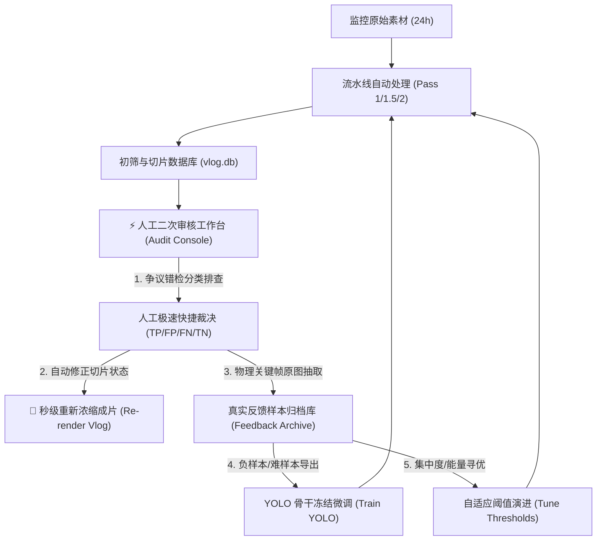
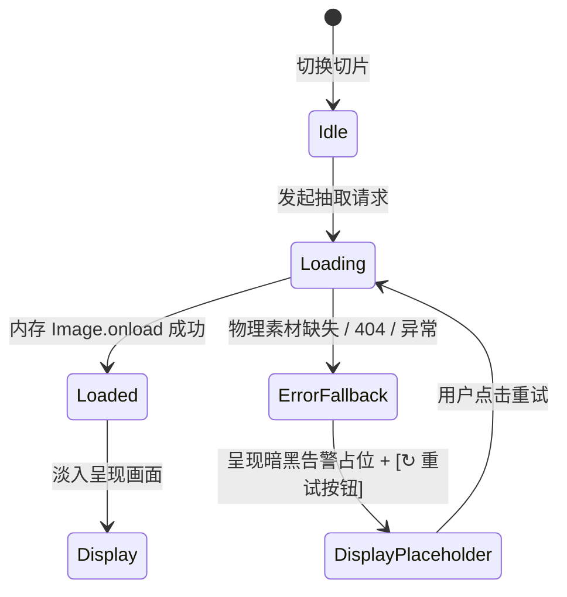

# HomeVlog 智能审核与人机协同工作台需求与交互设计规范 (PRD & UI/UX Spec)

> **版本**：v2.0.0  
> **面向对象**：前端研发团队、UI/UX 体验设计师、算法研发团队  
> **归档路径**：`/docs/AUDIT_WORKBENCH_PRD.md`  
> **交付目标**：规范 HomeVlog 人工二次审核平台的业务定位、交互引擎、视觉设计规范、接口契约与异常防护机制，指导全新前端与 UI/UX 设计的高保真落地。

---

## 一、 产品定位与业务闭环

### 1.1 背景与核心痛点
HomeVlog 致力于将家庭监控摄像头全天 24 小时（约 86,400 秒）的海量监控视频浓缩为 3~5 分钟的高清 Vlog 成片。流水线采用“空间集中度预筛选 + 光流能量 + YOLO 多目标验证”的三级级联检测算法。但在复杂家庭环境中，算法必然面临物理误报与漏报：
- **假阳性 (False Alarm, FP)**：日照反光、窗帘晃动、微尘飞虫、植物树影等产生伪动作能量，导致无人的空镜头被误判为动态（原速播放），严重拉长成片垃圾时间；
- **假阴性 (Missed Motion, FN)**：老人/婴儿微动、夜视暗光、远景低对比度微小动作，能量未达初筛阈值被误判为静态（15x~60x 快进），导致关键家庭高光时刻被粗暴掠过；
- **极短碎片抖动 (Jitter)**：算法在临界阈值反复跳变，产生大量 $< 3.0\text{s}$ 的破碎切片，破坏成片观感。

### 1.2 人机协同自演进闭环 (Active Learning Closed-Loop)
审核工作台不是单纯的标记工具，而是整个智能浓缩系统**模型与参数自进化的中枢神经**：



1. **秒级纠偏成片**：审核人员纠偏打标后，无需重跑耗时的 24 小时全帧解码与特征提取，直接调用底层 `StreamingOrchestrator` 执行秒级局部重新浓缩；
2. **沉淀真实反馈数据**：每次打标均由后台异步抽取无损关键帧落盘至反馈归档库并记录 `manifest.jsonl`，作为机位专属数据集持续反哺 YOLO 微调与空间集中度阈值寻优。

---

## 二、 核心用户画像与作业流程 (User Journey)

### 2.1 用户画像
- **核心用户**：家庭 Vlog 内容创作者 / 家庭安全管理员 / 算法标注评测人员；
- **核心诉求**：**极致的速度与确定性**。每天产生数十个监控视频文件、数百个切片，用户不可能在一堆混乱列表中逐个点击，需要工作台提供“智能筛选争议、键盘盲操、快速比对细节、秒级导出成片”的高效体验。

### 2.2 核心作业流 (Golden User Flows)

#### 流水线 A：疑难攻坚流（争议排查，默认推荐）
1. 用户进入工作台，顶部看板直观呈现当前审核进度与 Precision / Recall 指标；
2. 左侧默认激活【疑似误报 (FP)】分类视图，系统已按争议能量从高到低排列；
3. 用户选中首张疑难切片，时间轴自动聚焦展开放大该切片；
4. 用户查看中央三联画廊（起点、峰值能量帧、终点）；若疑似虚警，点击按键 `Y` 调起 YOLO 增强画框检测；
5. 若目标微小模糊，直接点击画面打开全屏 **Lightbox 高清微距视窗**，滚轮放大至 200% 确认是否为树影晃动；
6. 用户按下键盘 `2`（纠偏为静态误报 FP），系统自动落库、自动归档代表帧、时间轴变色，并**自动平滑切换并聚焦至下一个切片**；
7. 重复上述盲操（几分钟内过完数十个争议切片）；
8. 点击顶部「🚀 重新浓缩成片」，系统在几秒到十几秒内重新导出终极完美 Vlog。

#### 流水线 B：素材全局浏览流
1. 用户切换至【📁 全量目录】Tab，按“日期 ➔ 机位 ➔ 文件”层级树点选特定录像；
2. 时间轴展示该 5 分钟录像的全景切片分布，用户可在 Minimap 或 Focus Track 上自由缩放、拖拽浏览。

---

## 三、 功能架构与详细交互规范

整个工作台分为五大物理区域：**顶部核心看板**、**左侧错检分类与检索抽屉**、**双层联动交互时间轴**、**视觉审校三联画廊**、**极速指挥舱与模态视窗**。

```
+---------------------------------------------------------------------------------------------------+
|  HOMEVLOG STUDIO AUDIT    |  已审进度 [=====   ]  |  TP: 142  |  FP: 18  |  FN: 5  |  P/R: 88%/96%  |  [🚀重新浓缩] [💾归档库] [📊导出]  |
+---------------------------------------------------------------------------------------------------+
| [⚡疑难] [📁目录]            | 📹 cam0_20260320180514.mp4  [18:05:14 ~ 18:10:29]   ● 原判: DYNAMIC  ⏱️ 2.5s  ⚡ 能量: 3.20               |
| [全部] [FP] [FN] [短片] [已审] | +-----------------------------------------------------------------------------------------------+ |
| 🔍 搜索过滤... [排序方式 v]  | | 上层 Minimap (全景小地图 00:00 ~ 05:15):  [======[   Lens   ]==================================] | |
| -------------------------- | | 焦点工具栏: 视窗 02:10 ~ 02:35 (放大 12.0x)            [🔍+] [🔍-] [⊙聚焦切片] [⤢全景]                | |
| #104 DYNAMIC  2.5s         | | 下层 Focus Track (真实墙钟刻度尺 18:07:24 ~ 18:07:49):                                         | |
| ⚠️ 疑似光影假阳性 (无目标)     | | 18:07:24         18:07:30         18:07:36 (当前切片 居中放大 35% 宽)   18:07:42       18:07:49 | |
| ⚡ 峰值: 3.2  cam0_...mp4   | | [   STATIC   ]  |                 [#104 DYNAMIC 2.5s]                |  [   STATIC   ]         | |
|                            | +-----------------------------------------------------------------------------------------------+ |
| #108 STATIC   12.0s        | 视觉三联画廊:                                                                                    |
| 🎯 疑似微动漏检 (能量临界)     | +---------------------+   +------------------------------------+   +---------------------+        |
| ⚡ 峰值: 2.1  cam0_...mp4   | | 起点进入 (Start)    |   | ★ 核心峰值时刻 / YOLO (Peak HERO)   |   | 终点离开 (End)      |        |
|                            | | 18:07:34  (240.0s)  |   | 18:07:35 (241.25s)                 |   | 18:07:36 (242.5s)   |        |
| #112 DYNAMIC  1.8s         | | [缩略图 / 🔍点击放大] |   | [缩略图 / 🔍点击放大 / YOLO画框覆盖] |   | [缩略图 / 🔍点击放大] |        |
| ⏱️ 极短突发碎片 (1.8s)       | +---------------------+   +------------------------------------+   +---------------------+        |
+---------------------------------------------------------------------------------------------------+
| 快捷指令: [1]动态(TP)  [2]误报(FP)  [3]漏报(FN)  [4]纯静(TN)  |  [J]/[K] 上下切片  [Space] 动图微视频预览  [Y] YOLO强化画框        |
+---------------------------------------------------------------------------------------------------+
```

---

### 3.1 顶部核心质量看板 (Quality KPI Bar)
- **视觉风格**：磨砂玻璃微拟物胶囊卡片（Glassmorphism Pill Cards）；
- **核心组件**：
  1. **品牌徽标与模式状态**：`HOMEVLOG STUDIO AUDIT`，指示当前为「疑难优先排查」或「全量文件浏览」；
  2. **已审进度环/进度条**：显示已审切片数 / 总切片数，进度百分比进度条实时平滑更新；
  3. **指标四联胶囊**：
     - **有效动态 (TP)**：绿色高亮数字；
     - **光影误报 (FP)**：红色高亮数字；
     - **漏报微动 (FN)**：蓝色高亮数字；
     - **准确率与召回率 (Precision / Recall)**：实时依照公式计算：
       $$\text{Precision} = \frac{\text{TP}}{\text{TP} + \text{FP}} \times 100\%,\quad \text{Recall} = \frac{\text{TP}}{\text{TP} + \text{FN}} \times 100\%$$
  4. **全局快捷操作区**：
     - `[🚀 重新浓缩成片]`：主行动按钮，点击弹开 Re-render 控制面板；
     - `[💾 真实反馈归档库]`：显示已归档物理图片总张数；
     - `[📊 导出 CSV]` / `[📄 JSON]`：导出带有 UTF-8 BOM 的分析报表。

---

### 3.2 左侧错检分类与样本检索抽屉 (Categorized Explorer)
解决用户面对数百个切片“无从下手、分不清优先级”的问题。
- **宽度与折叠**：默认宽度 340px，支持点击 `◀ / ▶` 抽屉式收起以腾出全屏视野；
- **顶部分类胶囊栏 (Category Filter Tabs)**：
  - **全部 (`all`)**：全量争议切片汇总；
  - **疑似误报 (`fp_suspect`)**：初判 DYNAMIC 但 YOLO 未见目标且能量偏低，显示红点徽标与条目计数；
  - **疑似漏报 (`fn_suspect`)**：初判 STATIC 但能量达到临界区间（$1.5 \le \text{energy} \le 3.0$），显示蓝点徽标；
  - **短碎片 (`jitter`)**：时长 $< 3.0\text{s}$ 的突变碎片，显示黄点徽标；
  - **已复核 (`reviewed`)**：已完成打标的切片历史。
- **多维排序引擎**：下拉支持：
  - `⚡ 按争议/能量降序`（默认优先排查最严重的争议）；
  - `🕒 按时间先后顺序`；
  - `🕒 按时间从新到旧`；
  - `⏱️ 按切片时长`。
- **即时搜索过滤**：输入文件名、切片 ID 或原因关键字秒级过滤候选卡片；
- **疑难卡片设计**：
  - 左侧状态色条边框；
  - 首行：切片序号 `#ID`、算法原判（DYNAMIC/STATIC）、切片时长（如 `2.5s`）；
  - 核心标签：结构化展示归因（如 `⚠️ 疑似光影刚性 (无目标置信度)`、`🎯 疑似微动作漏判 (能量临界)`）；
  - 底行：能量峰值与源视频文件名省略号截断。

---

### 3.3 核心双层联动交互时间轴 (Dual-Track Timeline Engine)

#### A. 核心物理矛盾与破局方案
监控单文件通常为 5 分钟（300s~315s），而高频误报或漏报切片往往只有 2~3 秒。在传统单层时间轴上，2.5s 切片仅占全宽度的 $2.5 / 300 = 0.83\%$（在一千像素屏幕上仅约 6~8 像素），既无法展示文字信息，也极难通过鼠标精准选中，误触率极高。
**解决方案**：引入**双层联动时间轴架构**。

```
[ 上层 Minimap (全景小地图) ]  --> 物理文件 100% 全景平铺，展示宏观分布与 Lens 镜头框
           |
      联动与视窗映射
           v
[ 下层 Focus Track (切片焦点轨) ] --> 自动以当前切片为中心展开窗口，微小切片放大至占 30%~50% 视宽
```

#### B. 上层 Minimap（全景小地图）
- **职责**：提供整个视频文件的全局视角；
- **渲染规则**：将文件的全部切片映射到 0%~100% 绝对百分比，各切片按状态填充颜色（动态绿、静态深灰、误报红、漏报蓝）；
- **浮层镜头框 (Lens)**：半透明高亮矩形框，指示当前下层 Focus Track 正在观察的时间区间；
- **交互规范**：
  - 点击 Minimap 任意位置：下层焦点轨瞬间平移跳转至该时刻；
  - 拖拽 Lens 镜头框：实时横向平移下层可视窗口。

#### C. 下层 Focus Track（切片焦点交互轨）
- **自动展开发大算法**：
  当用户选中任一切片时，系统自动计算舒适的聚焦展开窗口跨度 $W$ 与起止时间 $[V_{\text{start}}, V_{\text{end}}]$：
  $$W = \min\left(T_{\text{file\_dur}}, \max\left(16.0\text{s}, T_{\text{seg\_dur}} \times 4.5\right)\right)$$
  $$V_{\text{start}} = \max\left(0, T_{\text{local\_mid}} - \frac{W}{2}\right),\quad V_{\text{end}} = \min\left(T_{\text{file\_dur}}, V_{\text{start}} + W\right)$$
  若 $V_{\text{end}} = T_{\text{file\_dur}}$，则反向补偿修正 $V_{\text{start}} = \max(0, V_{\text{end}} - W)$。
  **效果**：一段 2.5s 的微小切片，在展开为 16s 的视窗中将占据 $2.5 / 16 = 15.6\% \sim 35\%$ 的可视宽度（相当于 200px~450px），切片内部可清晰展示 `#ID 状态 (时长)` 标签，鼠标点击与边界拖拽极其舒适。
- **真实监控墙钟刻度尺 (Real Wall-Clock Ruler)**：
  - 时间轴刻度严禁显示枯燥难懂的日内绝对秒数（如 65114s）；
  - 系统根据文件名中携带的时间戳（如 `cam0_20260320180514.mp4` 提取基准时分秒 18:05:14），结合视窗秒数自动换算为**真实墙钟时间刻度**（如 `18:07:20`），并附注相对时间（如 `02:06.0`），使审核员直观与家庭生活作息对账。
- **手势操作体系**：
  - **滚轮缩放**：光标置于 Focus Track 上滚动滚轮，以鼠标所在时间点为锚点无级放大/缩小（缩放区间 4s ~ 全时长）；
  - **鼠标拖拽平移**：左键按住非色块空白区域左右拖拽，光标变为抓取状态（`grabbing`），平滑横向漫游；
  - **快捷按钮组**：提供「🔍 放大(+)」、「🔍 缩小(-)」、「⊙ 聚焦当前切片」、「⤢ 全局全景」四颗辅助按钮。

---

### 3.4 视觉审校三联画廊 (Triptych Cinema Gallery)

#### A. 布局架构与黄金比例
采用电影画幅三联画网格（Grid 1 : 1.35 : 1）：
1. **起点进入帧 (Start Frame)**：目标刚踏入画面或能量起始时刻；
2. **核心峰值能量帧 (Center Peak Frame / YOLO 检验点)**：
   - 居中放置，具有更宽的视幅与微拟物外发光轮廓（Hero Card），是人眼与算法审判的核心抓手；
   - 支持 YOLO 强化目标检测框覆盖叠加；
3. **终点离开帧 (End Frame)**：动作消散或目标离开画面时刻。

#### B. 防裂图安全状态机 (Safe Image Loading FSM)
严禁前端页面出现浏览器原生破损裂图（Broken Image Icon）。前端必须严格实现如下状态机：



- **加载态**：`img` 隐藏，占位卡片显示沙漏动画与动态闪烁骨架屏（`shimmer`）；
- **成功态**：后台离线 `new Image()` 加载完毕后一次性无缝切入，移除占位；
- **异常态**：素材离线或读取越界时，严禁暴露裸露空标签，优雅呈现“⚠️ 关键帧抽帧离线”占位卡片，并提供「↻ 点击重试」重连按钮。

#### C. YOLO 强化画框 (YOLO Enhance)
- 点击按钮或按快捷键 `Y`，后端调用微调模型执行推理；
- 中间峰值帧实时替换为带目标边界框（Bounding Box）与置信度标签的渲染图；
- 底部解析栏生成目标分类药丸标签（如 `👤 person 88%`、`🐾 dog 92%`）。

#### D. 动图微视频预览 (Micro-Video WebP Clip)
- 按 `Space` 空格键或点击「🎬 动图微视频预览」；
- 弹出轻量模态框，无缝循环播放该切片的 10fps 高画质动态 WebP 剪辑，帮助用户快速捕捉静态单帧无法察觉的微小动态（如远端窗帘微弱飘动）。

---

### 3.5 高清原画微距细节放大视窗 (High-Def Lightbox Viewer)
专为判定边缘争议设计（如微弱树影中是否有真猫、暗光床角是否有婴儿踢被）。

- **调起方式**：
  - 点击三联卡片头部右上角的「🔍 放大」按钮；
  - 或直接在卡片画面上悬停并点击（鼠标具备 `cursor: zoom-in` 及 `🔍 点击放大细节` 悬浮提示）。
- **视窗架构**：
  - 94vw / 90vh 大幅暗黑磨砂视窗（`#lightbox-modal`）；
  - **渐进式加载策略**：打开瞬间优先复用已有 640px 缓存帧垫底，防止白屏；后台并行异步拉取 `w=1920` 超高清原图（JPEG 质量因子 `q:v=2`）；
  - 若中继帧已具备 YOLO 检测结果，直接载入带有检测框的高清底图供细节检视。
- **全自由度缩放与拖拽引擎**：
  - **锚点滚轮缩放**：以当前鼠标像素坐标 $(M_x, M_y)$ 为缩放中心执行逆矩阵坐标补偿，支持 0.5x ~ 6.0x 无级放大：
    $$X_{\text{new}} = M_x - (M_x - X_{\text{old}}) \times \frac{S_{\text{new}}}{S_{\text{old}}},\quad Y_{\text{new}} = M_y - (M_y - Y_{\text{old}}) \times \frac{S_{\text{new}}}{S_{\text{old}}}$$
  - **拖拽平移 (Panning)**：在放大状态下按住左键任意拖拽视口；
  - **智能双击**：1.0x（全貌）与 2.0x（微距）一键瞬时切换；
  - **控制条**：顶部显式展示实时放大百分比（如 `180%`），并提供 `[＋ 放大]`、`[－ 缩小]`、`[⊙ 复位]`、`[1:1 原图]` 按钮。
- **键盘安全阻断**：开启 Lightbox 期间，拦截底层 `1/2/3/4` 打标键防止误触；支持 `Esc` 退出、`+`/`-` 缩放、`0` 复位。

---

### 3.6 极速快捷盲操指挥舱 (Action Cockpit & Hotkeys)
为专业质检员设计的“手不离键盘”盲操交互：

| 快捷按键 | 对应动作 | 业务影响 | 触发联动机制 |
| :--- | :--- | :--- | :--- |
| **`1`** | **确认有效运动 (TP)** | 算法判定正确，成片维持原速播放并保留高清画质。 | 自动落库 ➔ 异步归档代表帧 ➔ 时间轴切片变绿 ➔ **自动居中聚焦下一个切片** |
| **`2`** | **纠偏为静态误报 (FP)** | 将光影/微尘假阳性降级为静态快进。 | 自动落库 ➔ 异步归档代表帧 ➔ 时间轴切片变红 ➔ **自动居中聚焦下一个切片** |
| **`3`** | **纠偏为有人漏报 (FN)** | 将遗漏的微弱动态提级为原速播放。 | 自动落库 ➔ 异步归档代表帧 ➔ 时间轴切片变蓝 ➔ **自动居中聚焦下一个切片** |
| **`4`** | **确认纯静止 (TN)** | 确认为空镜纯静态段，维持超高倍速略过。 | 自动落库 ➔ 异步归档代表帧 ➔ 时间轴切片变灰 ➔ **自动居中聚焦下一个切片** |
| **`J` / `↓`** | **下一段切片** | 顺序检阅下一个样本。 | 焦点高亮移动 ➔ 时间轴平滑居中展开 ➔ 异步刷新三联帧 |
| **`K` / `↑`** | **上一段切片** | 回溯检阅上一个样本。 | 焦点高亮移动 ➔ 时间轴平滑居中展开 ➔ 异步刷新三联帧 |
| **`Space`** | **动图微视频预览** | 调起当前切片的 10fps WebP 动态预览模态框。 | 弹出 Modal 并循环播放短视频动图 |
| **`Y`** | **YOLO 强化画框** | 针对当前切片峰值时刻运行目标检测。 | 峰值卡片呈现检测框与多标签卡片 |
| **`Esc`** | **关闭所有模态框** | 退出 Lightbox、动图预览、归档库或重渲染面板。 | 恢复底层主工作台交互焦点 |

---

### 3.7 真实反馈帧归档管理抽屉 (Feedback Archive Modal)
- **功能定位**：直观展示算法持续进化所积累的“资产负债表”；
- **展示内容**：
  - 本地磁盘归档物理物理路径（如 `data/feedback_archive`）；
  - 真实样本图像总量与占用磁盘空间（MB）；
  - 已纠偏样本类型分布胶囊（动态确认 TP、光影误报 FP、漏报补录 FN、纯静确认 TN）；
  - `[⚡ 补齐全量历史归档]` 按钮：一键扫描全库，对所有已打标切片补齐物理帧原图归档。

---

### 3.8 实时秒级重浓缩控制台 (Re-render Console)
审核完成后的交付出口，支持有限状态机（FSM）全流程反馈：
- **状态流转**：`IDLE` ➔ `CHECKING`（素材物理可读性检测） ➔ `RENDERING`（硬件加速切片批量压制） ➔ `CONCATING`（合并封装成片） ➔ `COMPLETED`（或 `FAILED` / `CANCELLED`）；
- **智能防呆与容错保护**：
  - 素材可读性探测：若检测到 NAS 离线或部分物理视频丢失，控制台自动显示告警清单并标明“缺失 N 个文件（已触发自愈跳过）”，坚决杜绝报错闪退；
  - 动态批次进度条：实时显示已耗时、进度百分比、当前压制批次（如 `批次: 8 / 18`）；
  - 完成态行动：成片输出后呈现绿色完成标识与文件体积（MB），显示 `[📂 定位成片]` 按钮，点击一键唤起 Windows 文件管理器（Explorer）选中成片。

---

## 四、 接口契约与数据模型规范 (API Specifications)

### 4.1 时间戳双轨制换算规范 (Crucial)
前端在对接数据时，必须严格遵守**时间戳双轨制**原则，杜绝由于时序概念混淆引发的 Seek 越界或时间轴跳秒：

| 维度 | 字段名称 | 物理基准点 | 典型取值 | 业务消费场景 |
| :--- | :--- | :--- | :--- | :--- |
| **日内绝对时间** | `start_time` / `end_time` | 当天 `00:00:00` 起算的绝对秒数 | `65373.5s` (折合 18:09:33.5) | 用于 24 小时全局时间轴排序、拼接剪辑 (`concat`)、跨视频全局去重。 |
| **文件相对时间** | `local_t` | 单个物理文件 `0.0s` 起算的时间 | `259.5s` ($65373.5 - 65114.0$) | 用于所有针对单文件的 FFmpeg 抽帧、PyAV 寻道、WebP 动图截取。 |
| **真实墙钟时间** | `clock_time` | 真实人类世界挂钟时分秒 | `18:09:33` | 界面所有人类可见的刻度尺、标签徽标、SRT 字幕展示。 |

> **换算公式**：
> $$\text{file\_offset} = \text{hour} \times 3600 + \text{min} \times 60 + \text{sec}$$
> $$\text{local\_t} = \max\left(0.0, \min\left(\text{start\_time} - \text{file\_offset}, \text{file\_duration} - 0.1\right)\right)$$

---

### 4.2 REST API 详细清单

#### 1. 全局统计看板：`GET /api/overview`
- **请求参数**：无
- **返回数据模型**：
```json
{
  "total_files": 128,
  "total_segments": 1420,
  "reviewed_segments": 312,
  "labels": {
    "tp": 180,
    "fp": 92,
    "fn": 15,
    "tn": 25
  },
  "metrics": {
    "precision": 66.2,
    "recall": 92.3
  }
}
```

#### 2. 疑难切片分类列表：`GET /api/anomalies`
- **请求参数**：
  - `category` (string, 可选): `all` | `fp_suspect` | `fn_suspect` | `jitter` | `reviewed`，默认 `all`；
  - `date` (string, 可选): 格式 `YYYYMMDD`；
  - `cam_index` (int, 可选): 机位索引；
  - `limit` (int, 可选): 返回条数限制，默认 60。
- **返回数据模型**：
```json
[
  {
    "id": 104,
    "file_id": 12,
    "filepath": "D:\\videos\\cam0_20260320180514.mp4",
    "date": "20260320",
    "cam_index": 0,
    "start_time": 65373.5,
    "end_time": 65376.0,
    "duration": 2.5,
    "state": "DYNAMIC",
    "max_energy": 3.2,
    "avg_confidence": 0.0,
    "manual_label": null,
    "anomaly_type": "fp_suspect",
    "reason_desc": "疑似光影刚性 (无目标置信度)"
  }
]
```

#### 3. 单视频全量分段数据：`GET /api/file_segments`
- **请求参数**：`file_id` (int) 或 `filepath` (string)
- **返回数据模型**：
```json
{
  "file": {
    "id": 12,
    "filepath": "D:\\videos\\cam0_20260320180514.mp4",
    "date": "20260320",
    "cam_index": 0,
    "file_start_time": "20260320180514",
    "file_duration": 315.0,
    "prescreen_status": "COMPLETED",
    "analysis_status": "COMPLETED"
  },
  "segments": [
    {
      "id": 103,
      "start_time": 65114.0,
      "end_time": 65373.5,
      "duration": 259.5,
      "state": "STATIC",
      "max_energy": 0.42,
      "manual_label": null
    },
    {
      "id": 104,
      "start_time": 65373.5,
      "end_time": 65376.0,
      "duration": 2.5,
      "state": "DYNAMIC",
      "max_energy": 3.20,
      "manual_label": null
    }
  ]
}
```

#### 4. 高保真单帧提取接口：`GET /api/frame`
- **请求参数**：
  - `filepath` (string, 必需): 视频文件的物理绝对路径；
  - `t` (float, 必需): 绝对秒数或相对秒数；
  - `w` (int, 可选): 图像宽度像素，默认 `640`（缩略图），传 `1920` 获取 1080P 高清原画。
- **返回**：`Content-Type: image/jpeg`，高品质 JPEG 二进制流。若源文件丢失，返回带水印的占位图，状态码始终为 200。

#### 5. YOLO 目标检测强化接口：`POST /api/yolo_detect`
- **请求 Body**：`{"filepath": "...", "timestamp": 65374.75}`
- **返回数据模型**：
```json
{
  "image_url": "/api/frame_cached?name=annotated_cam0_20260320180514_260.75_640.jpg",
  "count": 1,
  "objects": [
    {
      "class": "person",
      "confidence": 0.882,
      "box": [120, 80, 240, 320]
    }
  ]
}
```

#### 6. 人工裁决打标提交接口：`POST /api/review`
- **请求 Body**：
```json
{
  "segment_id": 104,
  "manual_label": "FALSE_ALARM",
  "notes": "窗帘反光误报"
}
```
- **合法标签枚举**：`CONFIRMED_MOTION` (TP) | `FALSE_ALARM` (FP) | `MISSED_MOTION` (FN) | `CONFIRMED_STATIC` (TN)。
- **返回**：`{"success": true}`。

#### 7. 导出全量复核报表：`GET /api/export`
- **请求参数**：`format=csv` 或 `format=json`；
- **返回**：
  - CSV 模式：`Content-Type: text/csv; charset=utf-8`，前缀带 `\xef\xbb\xbf` UTF-8 BOM，响应头设置 `Content-Disposition: attachment; filename="homevlog_audit_YYYYMMDD_HHMMSS.csv"`；
  - JSON 模式：`Content-Type: application/json; charset=utf-8`。

#### 8. 重浓缩任务控制与轮询：`POST /api/rerender` / `GET /api/rerender_status`
- **启动任务 (`POST /api/rerender`)**：`{"date": "20260320", "cam_index": 0, "version": "reviewed"}`；
- **轮询状态 (`GET /api/rerender_status?date=...&cam_index=...`)**：
```json
{
  "date": "20260320",
  "cam_index": 0,
  "status": "RENDERING",
  "progress": 45,
  "current_batch": 9,
  "total_batches": 20,
  "elapsed_s": 14.8,
  "output_file": "output/vlog_20260320_cam0_reviewed.mp4",
  "file_size_mb": 0.0,
  "missing_files": [],
  "error": null
}
```

---

## 五、 UI 视觉规范与设计系统 (Design System)

### 5.1 视觉调性 (Theme & Aesthetic)
- **风格定义**：**暗黑科技质检工坊风格 (Dark Studio Theme)**。与专业调色套件（DaVinci Resolve / Premiere Pro）及安防监控控制中心对齐，降低审核人员在暗光环境下的视觉疲劳；
- **材质质感**：深沉纯黑底色与磨砂玻璃浮层叠加（Glassmorphism），边界采用超细半透明边框（Subtle Border `rgba(255,255,255,0.08)`）。

### 5.2 调色板与语义映射 (Color Palette)

| 语义对象 | CSS 变量 | 色值 (HEX) | 视觉含义与应用范围 |
| :--- | :--- | :--- | :--- |
| **画布底色** | `--bg-main` | `#070b14` | 全局背景，极深微蓝黑 |
| **卡片底色** | `--bg-card` | `#0b1120` | 工作面板底色，暗灰蓝 |
| **主强调色 (Cyan)**| `--color-cyan` | `#06b6d4` | 品牌色、高亮选中、当前切片边框 |
| **动态原速 (TP)** | `--color-green`| `#10b981` | 确认有效动态色块、高光徽标 |
| **误报降级 (FP)** | `--color-red` | `#f43f5e` | 光影虚警色块、警告徽标 |
| **漏报补录 (FN)** | `--color-blue` | `#6366f1` | 遗漏微动色块、补录标记 |
| **静态快进 (TN)** | `--color-static`| `#1e293b` | 纯静止底色、快进背景色块 |
| **突发碎片 (Jitter)**| `--color-amber` | `#f59e0b` | 极短抖动告警、能量预警 |

### 5.3 字体排印 (Typography)
- **常规正文**：`Inter`, `-apple-system`, `BlinkMacSystemFont`, "Segoe UI", sans-serif；
- **数据与时间专用等宽字体**：`Fira Code`, `JetBrains Mono`, `Consolas`, monospace。所有时间戳、墙钟时刻、坐标百分比、能量分值强制使用等宽字体，保证数据刷新时不产生跳动挤压。

---

## 六、 异常场景与边界防御规范 (Edge Cases & Fallbacks)

1. **极端极短切片（< 0.5s 或几帧）防护**：
   - 即使切片仅 0.2s，在 Minimap 轨上渲染的物理宽度不得低于 `0.3%`（防止不可见）；
   - 在 Focus Track 上，通过公式自适应放大，短切片最低保证占据 `5%` 视宽并居中，文字若放不下则自动收敛为 `#ID`；
2. **物理文件缺失或 Seek 寻道越界**：
   - 严禁触发任何未捕获的 500 / 404；
   - 视频不存在时，FFmpeg 抽取层由后端自动返回带有 `FILE NOT ACCESSIBLE` 水印的 640x360 占位 JPEG 图；
   - 前端三联画廊由安全状态机兜底，绝不展现浏览器原生红叉破损图；
3. **高频快捷键敲击防抖与请求排队**：
   - 快速连续敲击数字键 `1/2/3/4` 时，前端本地乐观更新（Optimistic Update）切片颜色与状态，后台以队列形式异步提交 `POST /api/review`，杜绝网络微延迟造成的界面卡顿；
4. **超宽屏与多分辨率自适应**：
   - 支持 1080P（1920x1080）基准屏、2K 生产屏及 4K 宽屏；
   - 关键帧三联画廊在不同分辨率下始终锁定 `16:9` 宽高比，严禁出现拉伸形变或溢出页面垂直滚动条。
