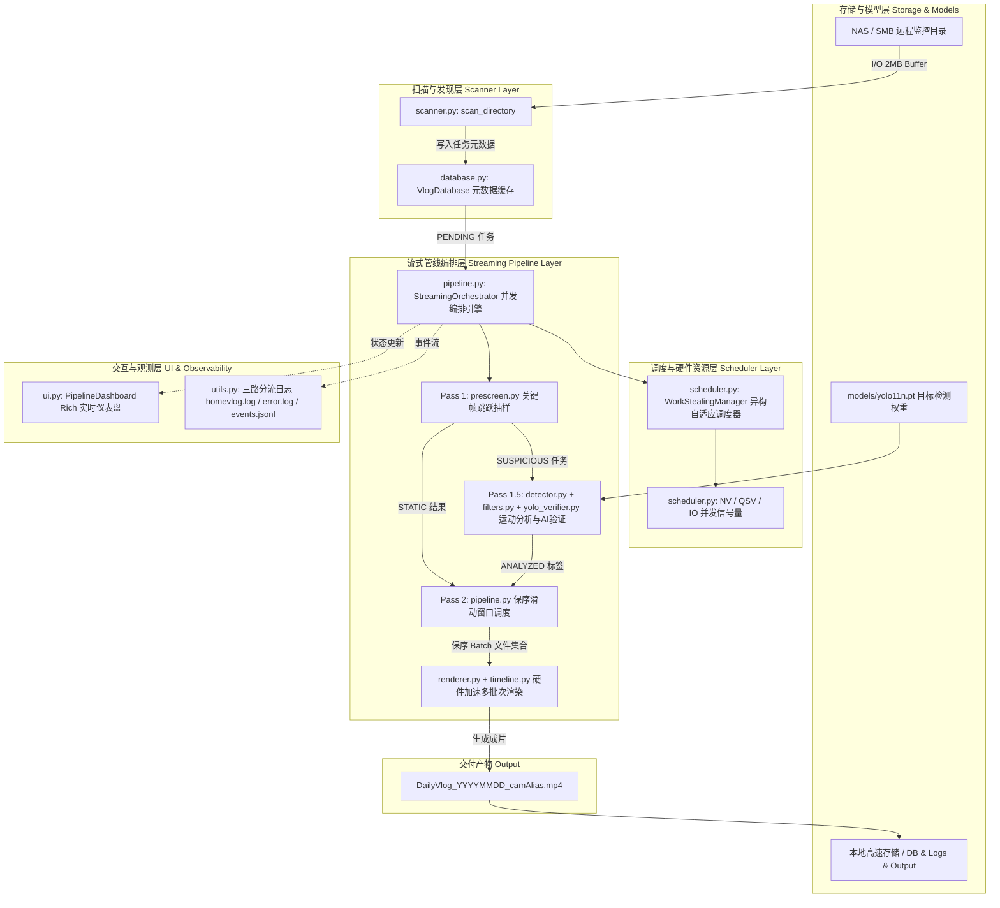

# HomeVlog 系统架构与实现规范

本文档详尽描述 HomeVlog 智能监控浓缩系统的全局架构、模块交互时序、数据流转机制以及核心组件的实现逻辑。

---

## 一、 系统总体架构与分层设计

HomeVlog 采用三级流式流水线（Streaming Pipeline）架构，将视频处理分解为快速预筛选、精细分析与硬件批次渲染三个核心阶段。各阶段通过内存队列解耦并重叠运行，避免了传统单体式批处理阶段间的显式同步等待。

---

## 二、 核心模块实现机制

### 1. 扫描与延迟元数据探测 ([`src/scanner.py`](../src/scanner.py))
- **设计职责**：扫描 NAS 远程目录中的 MP4 监控切片文件，解析文件名中的时间戳区间并向 SQLite 注册任务。
- **Lazy Metadata 约束**：禁止在扫描阶段调用 `ffprobe` 获取媒体元数据。仅依据文件名模式 `\d{2}_(\d{14})_(\d{14})\.mp4` 计算起止时间与时长，规避了成千上万次网络 RPC 导致的扫描卡顿。
- **稳定性校验**：针对正在写入的当日监控素材，提供 `scanner_freeze_minutes` 与 `file_stabilize_wait` 机制，防止读取不完整文件。

### 2. 快速预筛选 ([`src/prescreen.py`](../src/prescreen.py))
- **设计职责**：以极低算力快速过滤全天绝大部分无运动的静态文件（如夜间静止画面）。
- **关键帧跳跃探测 (Keyframe-Seeking)**：
  - 基于文件时长设定最大关键帧抽样数（`prescreen_segments`，默认 10）。
  - 通过 PyAV 设置 `skip_frame = "NONKEY"` 仅解码 I 帧，提取 Y 平面 8 倍下采样后使用 OpenCV AVX2 优化的 `cv2.norm(gray, prev_gray, cv2.NORM_L1)` 计算帧差。
  - 发现单对关键帧差异超过自适应阈值 `current_threshold` 时，触发即时早停（Early-Stop）并标记为 `SUSPICIOUS`，移交下一阶段。
  - 全量抽样差异均低于阈值时直接标记为 `STATIC`。

### 3. 时空滤波算法层 ([`src/filters.py`](../src/filters.py))
- **双差分滑动背景前景分离 (`EmaBackgroundModel`)**：
  - 基于 $B_t = (1 - \alpha) B_{t-1} + \alpha I_t$ 维护动态背景，前景像素低速吸收，背景像素高速更新。
  - 融合瞬时帧差 $D_{\text{frame}}$ 与背景残差 $D_{\text{bg}}$ 生成运动显著图 $M_t = \max(D_{\text{frame}}, \beta D_{\text{bg}})$。
- **8x8 空间网格连通域抗噪 (`SpatialGridMotionFilter`)**：
  - 将画面 ROI 划分为 64 个空间网格，自适应跟踪各单元底噪。
  - 8-邻域连通分量分析过滤孤立椒盐与高斯噪点，聚类放大连续肢体动作。
  - 空间-时域置信度衰减网格阻断早停漏检。
- **短时 RMS 音频活动检测 (`AudioEnergyVAD`)**：
  - 50ms 窗口分帧计算加权 RMS 与自适应 15 百分位数底噪，双阈值唤醒多模态动作段。

### 4. 精细运动分析与 AI 验证 ([`src/detector.py`](../src/detector.py), [`src/yolo_verifier.py`](../src/yolo_verifier.py))
- **设计职责**：对预筛选标记为可疑的文件进行自适应帧率逐帧差分分析，并在候选片段上触发 YOLO AI 目标过滤。
- **零转换灰度直通**：
  - 直接从 YUV420p 的 Y（亮度）平面提取灰度数据（`np.frombuffer(frame.planes[0])`），零色彩空间转换开销；YOLO 采样帧才走 `reformat(format='bgr24')` 路径。
- **JPEG 帧切片内存压缩池**：
  - 将暂存的 YOLO 候选帧通过 `cv2.imencode('.jpg')` 压缩为 JPEG 字节数组存入内存，单帧内存占用由 292KB 降至 15KB，降低内存驻留 95%。
- **全局动态批处理 (Dynamic Batching)**：
  - `YoloVerifier.verify()` 将同一文件内所有候选片段的采样帧汇总为一个全局 Batch，在 `torch.inference_mode()` 保护下进行单次前向推理，消除碎片化的小 Batch 调用开销。

### 5. 异构自适应调度器与资源隔离 ([`src/scheduler.py`](../src/scheduler.py))
- **三态动态工作窃取 (`WorkStealingManager`)**：
  - `NORMAL_DECOUPLED`：常规状态下分析任务 100% 走 Intel QSV 解码，RTX 3060Ti 专职 YOLO 推理与 Pass 2 NVENC 编码。
  - `COOPERATIVE_BURST`：当 `analysis_queue` 积压达到高水位线且无渲染时，出租 NVDEC 槽位协同抽干队列。
  - `RENDER_PREEMPTION_YIELD`：Pass 2 批次渲染启动信号到达时，强制剥夺 NVDEC 协同槽位，降级回 QSV，杜绝 NVENC 会话超限与 PCIe 带宽争用。
- **硬件并发信号量隔离**：
  - 独立管理 NV 编码会话信号量（上限 2，8GB 显存安全并发）、QSV 解码信号量（上限 8）与磁盘 I/O 信号量（上限 8）。

### 6. 保序滑动窗口与批次渲染 ([`src/pipeline.py`](../src/pipeline.py), [`src/renderer.py`](../src/renderer.py))
- **时序保序滑动窗口 (In-Order Sliding Window)**：
  - 跟踪全天物理时序队列 `all_tasks_ordered`，仅当队列头部连续的 $K$ 个文件全部分析就绪后，严格按时序打包为批次投递给渲染 Worker。
- **纯静态批次跳过非关键帧解码 (`-skip_frame nokey`)**：
  - 识别批次内纯静态文件集合，在解复用输入阶段注入 `-skip_frame nokey`，彻底消除夜间数小时静态画面的 NVDEC 冗余解码，将 `batch_0` 解码长尾缩短 70%~93.5%。
- **确定性渲染完成闭环 (`render_finished_event`) 与原子落盘**：
  - 主线程输入分发完毕后以 0.2s 轮询等待 `render_finished_event`，确保所有分发批次 100% 物理落盘与严格对账；批次先写入 `.tmp.mp4`，退出码与大小（$\ge 512\text{KB}$）双重校验通过后原子重命名为正式批次。
  - **断点自愈与防坏片保护**：若发生批次级失败，系统直接打标 `FAILED` 阻断最终 `concat` 合并，**完整保留已成功生成的批次文件**，严禁误删，确保下次启动秒级复用。
- **变速过渡曲线 ([`src/timeline.py`](../src/timeline.py))**：
  - 动态运动片段以原速（1x）播放并保留原声音频。
  - 静态片段计算 $C^1$ 连续平滑非线性过渡 PTS 曲线，消除跳帧顿挫感。
  - 多批次通过 FFmpeg 并发编码生成中间片段，最后通过 `-f concat -c copy` 实现无损零重编码最终拼接。

### 7. 数据库并发与持久化 ([`src/database.py`](../src/database.py))
- **读写完全解耦**：采用 SQLite WAL 模式（`PRAGMA journal_mode=WAL`），读查询无阻塞并发。
- **单写锁串行化**：所有写操作经 `threading.Lock` 串行提交，规避多线程并发写冲突；数据库以 filepath 唯一约束保证断点续跑幂等。

### 8. 现代交互、三路分流日志与优雅停机 ([`src/ui.py`](../src/ui.py), [`src/utils.py`](../src/utils.py))
- **Rich 动态控制台终端**：`PipelineDashboard` 提供三阶段进度、积压水位、硬件调度状态徽标、全天素材工序堆叠分布条与实时告警跑马灯；日志桥接器（`RichConsoleBridgeHandler` + `register_dashboard`）在 Live 模式下将 WARNING/ERROR 自动汇入告警区。tqdm 已完全移除，终端输出统一由 Rich 呈现；非 TTY/无头环境自动降级为纯日志输出。
- **0.1s 极速 Ctrl+C 优雅停机**：废弃不可中断的无超时 `queue.join()`，采用 0.2s 轮询与 `abort_event`；捕获中断瞬间调用 `FFmpegProcessRegistry.kill_all()` 瞬间杀灭全部后台 GPU 编码与管道解码子进程，精准识别 SIGINT 信号并抑制误导性报错，实现 0 孤儿进程残留安全停机。
- **信号量超时防护**：所有硬件/IO 信号量经 `acquire_with_retry()`（30s 超时 + 6 次重试，提供 180s 充裕宽限期）获取，杜绝高负载突发时的假死与慢速 PyAV 降级。
- **三路日志分流架构**：
  - 主运行追踪日志：`logs/homevlog_*.log`；
  - 异常告警日志：`logs/error_*.log`；
  - 结构化机器审计流：`logs/events_*.jsonl`。

