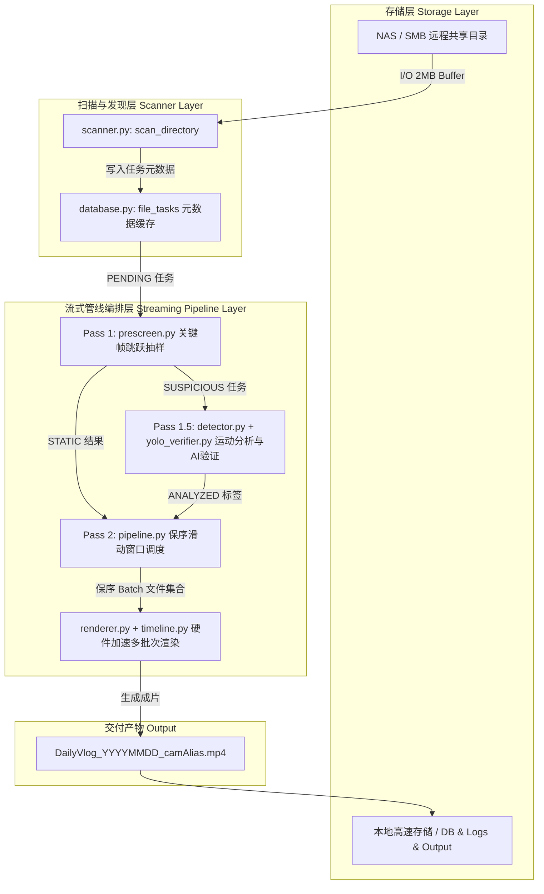

# HomeVlog 系统架构与实现规范

本文档详尽描述 HomeVlog 智能监控浓缩系统的全局架构、模块交互时序、数据流转机制以及核心组件的实现逻辑。

---

## 一、 系统总体架构与分层设计

HomeVlog 采用三级流式流水线（Streaming Pipeline）架构，将视频处理分解为快速预筛选、精细分析与硬件批次渲染三个核心阶段。各阶段通过内存队列解耦并重叠运行，避免了传统单体式批处理阶段间的显式同步等待。

---

## 二、 核心模块实现机制

### 1. 扫描与延迟元数据探测 ([`src/scanner.py`](file:///c:/Users/seeyo/code/homevlog/src/scanner.py))
- **设计职责**：扫描 NAS 远程目录中的 MP4 监控切片文件，解析文件名中的时间戳区间并向 SQLite 注册任务。
- **Lazy Metadata 约束**：禁止在扫描阶段调用 `ffprobe` 获取媒体元数据。仅依据文件名模式 `\d{2}_(\d{14})_(\d{14})\.mp4` 计算起止时间与时长，规避了成千上万次网络 RPC 导致的扫描卡顿。
- **稳定性校验**：针对正在写入的当日监控素材，提供 `scanner_freeze_minutes` 与 `file_stabilize_wait` 机制，防止读取不完整文件。

### 2. 快速预筛选 ([`src/prescreen.py`](file:///c:/Users/seeyo/code/homevlog/src/prescreen.py))
- **设计职责**：以极低算力快速过滤全天绝大部分无运动的静态文件（如夜间静止画面）。
- **关键帧跳跃探测 (Keyframe-Seeking)**：
  - 基于文件时长计算 $N$ 个均分关键帧时间戳（$N \approx 8 \sim 12$）。
  - 调用 PyAV 的 `container.seek()` 直接跳跃至最近 I 帧，仅解码关键帧并使用 OpenCV AVX2 优化的 `cv2.norm(gray, prev_gray, cv2.NORM_L1)` 计算帧差。
  - 发现单对关键帧差异超过自适应阈值 `current_threshold` 时，触发即时早停（Early-Stop）并标记为 `SUSPICIOUS`，移交下一阶段。
  - 全量抽样差异均低于阈值时直接标记为 `STATIC`。

### 3. 精细运动分析与 AI 验证 ([`src/detector.py`](file:///c:/Users/seeyo/code/homevlog/src/detector.py), [`src/yolo_verifier.py`](file:///c:/Users/seeyo/code/homevlog/src/yolo_verifier.py))
- **设计职责**：对预筛选标记为可疑的文件进行自适应帧率逐帧差分分析，并在候选片段上触发 YOLO AI 目标过滤。
- **单次色彩空间转换**：
  - 仅对满足 YOLO 采样步长的帧执行一次 `reformat(format='rgb24')` 转换，灰度差分直接复用转出的 RGB 数据进行 OpenCV SIMD 灰度化；非 YOLO 采样帧直接提取单通道灰度。
- **JPEG 帧切片内存压缩池**：
  - 将暂存的 YOLO 候选帧通过 `cv2.imencode('.jpg')` 压缩为 JPEG 字节数组存入内存，单帧内存占用由 292KB 降至 15KB，降低内存驻留 95%。
- **全局动态批处理 (Dynamic Batching)**：
  - `YoloVerifier.verify()` 将同一文件内所有候选片段的采样帧汇总为一个全局 Batch，在 `torch.inference_mode()` 保护下进行单次前向推理，消除碎片化的小 Batch 调用开销。

### 4. 保序滑动窗口与批次渲染 ([`src/pipeline.py`](file:///c:/Users/seeyo/code/homevlog/src/pipeline.py), [`src/renderer.py`](file:///c:/Users/seeyo/code/homevlog/src/renderer.py))
- **设计职责**：按时间顺序合并与浓缩视频切片，生成每日浓缩 Vlog。
- **时序保序滑动窗口 (In-Order Sliding Window)**：
  - `_render_manager` 跟踪全天物理时序队列 `all_tasks_ordered`。
  - 维护头部未分发指针 `next_dispatch_ptr`，仅当队列头部连续的 $K$ 个文件（$K = \text{batch\_max\_files}$）全部分析就绪后，严格按时序打包为批次投递给渲染 Worker。
- **硬件滤镜图构建 ([`src/timeline.py`](file:///c:/Users/seeyo/code/homevlog/src/timeline.py))**：
  - 动态运动片段以原速（1x）播放并保留原声音频。
  - 静态片段通过 `setpts` 与 `fps` 滤镜进行幻灯片极速压缩（如 60x 浓缩）并填充无源音频。
  - 多批次通过 FFmpeg 并发编码生成中间片段，最后通过 `-f concat -c copy` 实现无损零重编码最终拼接。

### 5. 数据库并发与持久化 ([`src/database.py`](file:///c:/Users/seeyo/Documents/homeVlog/src/database.py))
- **设计职责**：管理任务状态机（PENDING → SUSPICIOUS/STATIC → ANALYZED → COMPLETED）与元数据持久化。
- **读写完全解耦**：
  - 采用 SQLite WAL 模式（`PRAGMA journal_mode=WAL`），所有查询方法无阻塞并发读取。
  - 后台写入线程 `_async_writer` 采用批量事务提交（Batch Commit，每次聚合至多 50 条写入操作），大幅降低磁盘同步 `fsync` 频率。

### 6. 异构算力全双工物理解耦与防死锁设计 ([`src/pipeline.py`](file:///c:/Users/seeyo/Documents/homeVlog/src/pipeline.py), [`src/renderer.py`](file:///c:/Users/seeyo/Documents/homeVlog/src/renderer.py))
- **全双工芯片级分工 (Full-Duplex Decoupling)**：
  - **Intel UHD 770 (Decode-Only)**：专职 100% 硬件解码。双 Gen12 VDBox 负责 Pass 1 预筛选（8路并发）与 Pass 1.5 密集多模态分析解码，彻底规避核显媒体总线与 CPU 共享系统内存带宽的争抢。
  - **NVIDIA RTX 3060Ti (Inference & Encode-Only)**：专职 Tensor Core YOLOv11 批前向推理与 Pass 2 双路 NVENC 满血硬件编码。
- **管道写死锁物理根除 (Deadlock Elimination)**：
  - 在包含数十个输入流与复杂多项式变速滤镜的超大批次（如包含 66 个输入切片的 FilterComplex）中，FFmpeg 子进程输出的日志迅速突破操作系统内核匿名管道（64KB）上限。
  - 架构将 `stdout` 设为 `subprocess.DEVNULL`，并将 `stderr` 异步重定向至 SSD 上的临时日志文件，彻底物理性清除了操作系统的写挂起死锁（Block on Write）。

