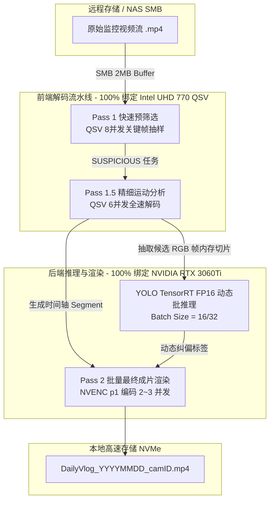

# HomeVlog 异构算力调度优化方案与演进路线

本文档详细记录 HomeVlog 系统在 **Intel Core i5-12600K (UHD 770 iGPU) + NVIDIA GeForce RTX 3060Ti (8GB dGPU)** 平台下的异构算力深度优化设计与未来演进方案。

---

## 1. 硬件架构与物理特性分析

### 1.1 硬件资源拓扑
- **CPU**: Intel Core i5-12600K (6P + 4E 混合架构，共 16 线程)
- **iGPU (核显)**: Intel UHD Graphics 770
  - 拥有 2 个独立的 MFX 媒体编码/解码引擎 (Dual VDBox)。
  - 极高并发的 H.264/HEVC 硬件解码吞吐，且与独立显卡显存完全隔离，使用系统主存 (DDR4/DDR5)。
- **dGPU (独显)**: NVIDIA GeForce RTX 3060Ti 8GB
  - 拥有 4864 个 CUDA Core 与 152 个 Tensor Core (第 3 代)。
  - 拥有 1 个第 7 代 NVENC 硬件编码器与 1 个第 5 代 NVDEC 硬件解码器。
  - 受显卡驱动限制，并发 NVENC 会话上限通常为 3~5 个。

---

## 2. 现有调度的瓶颈与干扰成因

### 2.1 独显资源争用 (Resource Contention on dGPU)
当前流水线中，RTX 3060Ti 同时承载了三类异构任务：
1. **Pass 1.5 分析解码 (NVDEC)**
2. **YOLO 目标检测推理 (CUDA / Tensor Core)**
3. **Pass 2 批量视频渲染导出 (NVENC / CUDA Filters)**

**物理干扰影响**：
- 当 NVDEC 与 NVENC 频繁高并发启动时，GPU 驱动会触发上下文切换（Context Switching），导致 CUDA 核心与 Tensor 核心的可用 PCIe 带宽受限。
- YOLO 密集推理引发的显卡功耗波动可能触发显卡 P-State 动态降频，进而波及同卡上正在进行的视频硬件编码。

---

## 3. 终态优化架构：算力职责物理隔离 (Zero-Contention Multi-Heterogeneous Pipeline)

### 3.1 各引擎专职分工

| 算力单元 | 物理设备 | 承担任务 | 推荐配置参数 | 核心设计目标 |
| :--- | :--- | :--- | :--- | :--- |
| **iGPU Dual VDBox** | Intel UHD 770 | 1. 快速预筛选 (Prescreen) 2. 运动分析解码 (Analysis) | `max_qsv_concurrency: 8` `prescreen_parallel: 8` | 释放全部独显算力，压榨核显双解码引擎 |
| **dGPU Tensor Core** | RTX 3060Ti | YOLO TensorRT 批量推理 | `device: cuda:0` `model_path: yolo11n.engine` | 专职 AI 目标识别，0 解码开销 |
| **dGPU NVENC** | RTX 3060Ti | Pass 2 最终视频剪辑与压制导出 | `max_nv_concurrency: 3` `preset: p1` | 高画质与极速硬件编码导出 |

---

## 4. 动态任务窃取调度机制 (Dynamic Work-Stealing)

当某一天监控素材极多（如超过 300 个切片文件）且 QSV 解码队列产生积压时，引入动态算力溢出保护机制：

1. **水位监控**：
   - 监听 `analysis_queue.qsize()`。
   - 若积压任务数 $> 15$，且 RTX 3060Ti 的 `NVENC` 未处于渲染峰值，允许动态分配 1~2 个 `cuda` 解码 Worker 参与分析。
2. **算力回缩**：
   - 一旦流水线进入高并发渲染阶段（`render_batch_queue` 饱和），自动回收 CUDA 解码 Worker，将其全部算力交还给 NVENC 与 TensorRT。

---

## 5. 预期收益与量化指标

- **解码吞吐率**：UHD 770 双 VDBox 全速并行可达 **1200+ FPS** 复合解码能力。
- **渲染稳定性**：NVENC 编码不会因前端解码占用显存带宽而出现抖动，导出帧率稳定在 **300+ FPS**。
- **流水线重叠度**：前端预筛/分析与后端渲染完全异步解耦，单日 24 小时监控素材浓缩整体耗时预期缩短至 **3~5 分钟**。
