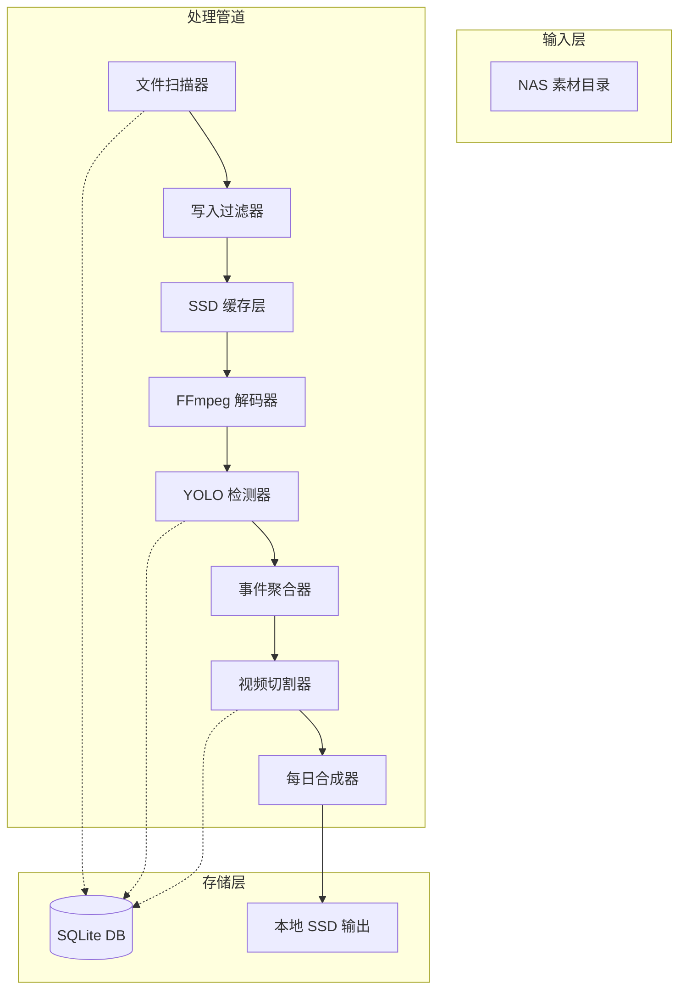

homeVlog 项目 AI Coding 开发对齐指南 (V1.0)

本指南为 homeVlog 自动化浓缩流水线的唯一参考标准。AI 模型在生成代码时必须严格遵循以下架构决策、逻辑契约与性能红线，严禁引入未经说明的第三方深度绑定库（如 VPF）。
1. 项目定义与目标 (Project Scope)

    输入：4K HEVC 监控素材（20fps, 3Mbps, 128MB/文件）。

    目标：通过 YOLO 语义检测 识别目标（人/宠/车），并利用 IoU 静止抽稀算法 压缩静态冗余，产出每日浓缩 Vlog。

    硬件基准：Intel i5-12600K (QSV) + NVIDIA RTX 3060 Ti (8GB VRAM)。

2. 核心架构：稳健解耦管道 (Robust Decoupled Pipeline)

为规避显存指针管理的脆弱性，项目废弃全显存零拷贝方案，采用 FFmpeg IPC 管道 模式。
阶段	实现方式	硬件分配	关键参数
解码抽帧	FFmpeg 硬件解码 -> stdout 管道输出	12600K (QSV) / 3060Ti (NVDEC)	scale=640:640, fps=5, format=rgb24
语义推理	TensorRT 推理引擎 (FP16)	3060Ti (CUDA 核心)	YOLOv11s, Batch Size=8~16
逻辑分析	IoU 轨迹追踪 + 时间轴聚合	CPU (P-Core)	IoU_Threshold=0.85, Static_Interval=60s
物理切割	多线程 FFmpeg 并行切片	3060Ti (NVENC) / I/O 并发	并发数由 parallel_jobs 驱动
Export to Sheets
3. 关键算法逻辑：语义级静止抽稀 (Semantic Thinning)

AI 模型在实现 cutter.py 逻辑时，必须遵循以下步骤：

    目标追踪：计算连续检测帧中同一类别目标的 BBox IoU。

    静止判定：

        若 IoU > 0.85 且目标数量不变，判定为 Static (静止期)。

        若 IoU < 0.85 或检测到新目标，判定为 Motion (运动期)。

    采样策略：

        运动期：保留所有检测点对应的视频区间。

        静止期：强制执行“脉冲式”采样，每 60,000ms 仅保留 1 个事件锚点。

4. 技术栈契约 (Tech Stack Contract)

    核心语言：Python 3.12 (锁定版本以确保 TensorRT 兼容性)。

    推理引擎：tensorrt + cuda.bindings.runtime (严禁使用原生 ONNXRuntime 以免性能崩溃)。

    并行模型：

        使用 DbWriterProxy 异步写入 SQLite 以防止数据库死锁。

        使用 ThreadPoolExecutor 处理 I/O 密集型切割任务。

    数据结构：

        Detection：包含 class_name, confidence, bbox 坐标。

        TimeSegment：包含 start_ms, end_ms。

5. 性能红线与工程约束 (Engineering Constraints)

    禁止项：

        严禁 在分析阶段产生中间临时帧图像落盘（只能通过 Pipe 或内存传递）。

        严禁 多个进程同时初始化 TensorRT Engine（必须单例 GPU Worker）。

        严禁 忽略 FFmpeg 的 VFR (变帧率) 特性，必须基于 pts 进行逻辑对齐。

    必选项：

        必须 包含“自愈机制”：若硬件解码进程崩溃，需能自动回收并重启 Worker。

        必须 实现“有界队列”：防止解码速度远超推理速度导致的内存溢出。

        必须 支持 RAMDisk 路径配置，以优化切割片段的临时写入。

6. 接口约定 (API Mock)
``` python

# 检测器核心接口 (detector.py)
class TRTEngine:
    def infer_batch(self, frames: list[np.ndarray]) -> list[np.ndarray]: ...

# 切割器核心逻辑 (cutter.py)
class EventAggregator:
    def aggregate(self, timestamps_ms: List[int]) -> List[TimeSegment]: ...
    def _apply_static_thinning(self, detections: List[dict]) -> List[int]: ...
```

# homeVlog Feature Specification (V1.0)

## 1. 产品愿景

**一句话愿景**：将家庭监控素材自动浓缩为家人专属的每日生活 Vlog。

通过 AI 语义检测与智能抽稀，让忙碌的家长无需手动剪辑，即可获得宝宝和宠物每日成长的高光集锦。

---

## 2. 用户故事

| 角色 | 故事 |
| --- | --- |
| **家长** | 作为用户，我希望在周末空闲时启动程序自动处理一周的监控素材，这样我不需要逐个文件查看就能看到宝宝每天的有趣瞬间。 |
| **家长** | 我希望浓缩后的视频保留原始画质和声音，这样观看时不会因为画质损失影响体验。 |
| **家长** | 我希望程序能跳过已处理的文件和正在写入的新文件，这样我可以随时让 NAS 继续录制而不中断处理。 |
| **家长** | 我希望程序在中断后能从断点恢复，这样我不必担心长时间运行中被关闭而前功尽弃。 |


---

## 3. 功能边界

### 3.1 核心功能（Must Have）

| 功能 | 描述 | 验收标准 |
| --- | --- | --- |
| F1 文件扫描 | 扫描 NAS 输入目录，识别待处理 MP4 文件 | 仅识别 .mp4，跳过非文件；文件名含时间戳可解析 |
| F2 写入检测 | 检测文件是否正在被摄像头写入 | 连续 2 次采样文件大小不变视为已写完；或检测文件句柄可用性 |
| F3 幂等处理 | 记录已处理文件列表 | SQLite 记录 source_path + hash，已存在则跳过 |
| F4 日期解析 | 从文件名或视频元数据提取素材时间范围 | 优先级：视频元数据 > 文件名解析；格式 `YYYYMMDD_HHMMSS` |
| F5 跨天拆分 | 素材跨越 00:00 时按日期边界拆分为独立片段 | 片段 1 归前天，片段 2 归后天 |
| F6 跨天调度 | 等待跨天片段整体处理完毕后才输出当日 Vlog | 前一天最后一个跨天文件未完成时，该天 Vlog 不生成 |
| F7 目标检测 | YOLOv11s 检测人/宝宝/猫/狗 | 4 类；输出 class_name, confidence, bbox |
| F8 静止抽稀 | IoU>0.85 且目标数量不变时判定静止 | 运动期全保留；静止期每 60s 保留 1 个锚点 |
| F9 视频切割 | 按检测结果切割原始素材为片段 | 保留原始分辨率、码率、音频 |
| F10 每日合成 | 将同一天所有有效片段合成为完整 Vlog | 按时间顺序排列；文件名含日期范围 |
| F11 断点恢复 | 处理中断后从 SQLite 记录点恢复 | 记录单位：文件级 + 日期级 |
| F12 错误容错 | 单文件损坏跳过并记录；若某天存在损坏文件则不生成该天 Vlog | 损坏判定：FFmpeg 无法解码；日志记录 source + 原因 |
| F13 进度展示 | CLI 实时显示处理进度 | tqdm 进度条 + 滚动日志（当天文件/总文件，预计剩余时间） |
| F14 跨天超时 | 跨天文件等待超时机制 | 超过配置时间未完成则跳过并告警 |
| F15 健康检查 | 硬件状态监控 | GPU 显存、CPU 温度监控，异常时降频或暂停 |


### 3.2 非目标（Out of Scope）

- 音频降噪或处理
- 多摄像头支持
- Web UI / GUI 界面
- 异常声音检测
- 视频元数据以外的分类（如按场景）
- 移动端 App

---

## 4. 开发环境与硬件抽象层

### 4.1 环境差异

| 环境 | 硬件配置 | 限制 |
| --- | --- | --- |
| **目标机器** | Intel i5-12600K + RTX 3060 Ti 8GB | 完整功能支持 |
| **开发机器** | 核显笔记本（无 NVIDIA GPU） | 无法运行 TensorRT/CUDA |


### 4.2 硬件抽象层 (HAL) 设计

```python
# src/pipeline/worker.py
class GPUBackend:
    """目标机器：TensorRT FP16 推理"""
    def infer_batch(self, frames: np.ndarray) -> List[Detection]:
        ...

class MockBackend:
    """开发环境：无 GPU 时使用 Mock 返回空检测"""
    def infer_batch(self, frames: np.ndarray) -> List[Detection]:
        return []

class DecoderBackend:
    """根据环境自动选择解码器"""
    @staticmethod
    def create():
        if has_nvidia_gpu():
            return NVDECBackend()
        else:
            return CPUBackend()  # OpenCV 软件解码
```

### 4.3 模块开发优先级

| 优先级 | 模块 | 开发环境可测 | 说明 |
| --- | --- | --- | --- |
| P0 | `time_utils`, `iou`, `logger` | ✅ | 纯逻辑，无硬件依赖 |
| P0 | `database`, `cache`, `checkpoint` | ✅ | 文件 I/O，开发机可测 |
| P0 | `scanner`, `filter` | ✅ | 文件扫描，开发机可测 |
| P0 | `aggregator`（静态抽稀） | ✅ | CPU 计算，开发机可测 |
| P1 | `decoder`, `cutter`, `merger` | ⚠️ 部分可测 | 依赖 FFmpeg，无 GPU 时可测文件操作逻辑 |
| P2 | `detector`（TensorRT） | ❌ 需 GPU | 迁移到目标机器后实现 |
| P2 | `model conversion` 脚本 | ❌ 需 GPU | 迁移到目标机器后执行 |
| P1 | `coordinator`, `worker` | ⚠️ 接口可测 | 先写接口定义，逻辑在目标机验证 |


### 4.4 开发策略

1. **先开发 P0 模块**：在开发机上完成所有不依赖 GPU 的代码
2. **定义 HAL 接口**：在开发阶段就写好 `GPUBackend` / `MockBackend` 的接口契约
3. **开发阶段跳过检测**：使用 MockBackend，验证数据流和控制逻辑
4. **迁移后实现 GPU 代码**：在目标机器上实现 TensorRT 推理并替换 Mock
5. **端到端集成测试**：在目标机器上做完整流程验证

### 4.5 检测配置项

```
# config.yaml
hardware:
  backend: "auto"  # auto / gpu / mock
```

---

## 5. 数据流与模块设计

### 4.1 系统架构



### 4.2 核心模块

| 模块 | 职责 | 关键接口 |
| --- | --- | --- |
| `scanner` | 扫描输入目录，解析文件名时间戳 | `scan(input_dir) -> List[VideoFile]` |
| `filter` | 检测写入中文件，过滤已处理文件 | `filter(files, db) -> List[VideoFile]` |
| `cache` | 管理 SSD 缓存，支持 LRU 淘汰 + 校验 | `cache.copy(src) -> local_path` |
| `decoder` | FFmpeg 硬件解码，帧提取通过 Pipe 传递 | `decode(local_path) -> Iterator[Frame]` |
| `detector` | TensorRT FP16 推理，Batch 处理 | `infer_batch(frames) -> List[Detection]` |
| `aggregator` | IoU 轨迹追踪，时间轴聚合 | `aggregate(detections) -> List[TimeSegment]` |
| `cutter` | 多线程 FFmpeg 切割片段 | `cut(video, segments) -> List[Clip]` |
| `merger` | 合成每日 Vlog | `merge(clips, date) -> daily_vlog` |


---

## 6. SQLite 数据库设计

### 6.1 表结构

```sql
-- 文件处理状态表
CREATE TABLE processed_files (
    id INTEGER PRIMARY KEY AUTOINCREMENT,
    source_path TEXT UNIQUE NOT NULL,       -- 原始文件路径
    file_hash TEXT,                          -- 文件哈希（用于校验）
    time_start TEXT,                         -- 素材起始时间 ISO8601
    time_end TEXT,                           -- 素材结束时间 ISO8601
    status TEXT DEFAULT 'pending',           -- pending / processing / completed / failed / pending_retry
    error_msg TEXT,                          -- 失败原因
    processed_at TEXT,                       -- 完成时间
    created_at TEXT DEFAULT CURRENT_TIMESTAMP
);

-- 日期处理状态表
CREATE TABLE processed_days (
    id INTEGER PRIMARY KEY AUTOINCREMENT,
    date TEXT UNIQUE NOT NULL,               -- 日期 YYYYMMDD
    status TEXT DEFAULT 'pending',            -- pending / processing / completed / failed
    file_count INTEGER DEFAULT 0,             -- 当天涉及文件数
    completed_count INTEGER DEFAULT 0,       -- 已完成文件数
    output_path TEXT,                         -- 最终 Vlog 路径
    total_duration_ms INTEGER,                -- 浓缩后时长 ms
    created_at TEXT DEFAULT CURRENT_TIMESTAMP,
    updated_at TEXT DEFAULT CURRENT_TIMESTAMP
);

-- 性能日志表
CREATE TABLE performance_log (
    id INTEGER PRIMARY KEY AUTOINCREMENT,
    file_id INTEGER REFERENCES processed_files(id),
    stage TEXT NOT NULL,                      -- decode / detect / aggregate / cut / merge
    duration_ms INTEGER NOT NULL,             -- 耗时 ms
    gpu_memory_mb INTEGER,                    -- GPU 显存峰值 MB
    batch_size INTEGER,                       -- 批处理大小
    logged_at TEXT DEFAULT CURRENT_TIMESTAMP
);

-- Checkpoint 表（断点恢复）
CREATE TABLE checkpoint (
    id INTEGER PRIMARY KEY,
    current_file_id INTEGER,                  -- 当前处理到哪个文件
    current_day TEXT,                         -- 当前处理到哪个日期
    last_updated TEXT DEFAULT CURRENT_TIMESTAMP
);
```

### 6.2 数据库优化策略

| 优化项 | 方案 | 说明 |
| --- | --- | --- |
| **WAL 模式** | `PRAGMA journal_mode=WAL` | 读操作不阻塞写操作，提升并发性能 |
| **批量写入** | 积累 20 条记录后批量落盘 | 减少文件锁竞争 |
| **连接池** | 复用单一 DB 连接 | 避免频繁建立连接的开销 |
| **异步日志** | 性能日志写入后台队列 | 不阻塞主处理流程 |


### 6.3 索引

```sql
CREATE INDEX idx_files_status ON processed_files(status);
CREATE INDEX idx_files_time ON processed_files(time_start, time_end);
CREATE INDEX idx_days_status ON processed_days(status);
CREATE INDEX idx_perf_file ON performance_log(file_id);
```

---

## 7. 关键算法说明

### 7.1 静止抽稀算法

```
输入: List[Detection]  # 每帧检测结果，包含目标 bbox 和类别

1. 初始化空列表 trajectories, segments
2. 对每帧检测结果:
   a. 计算与上一帧同类别目标的 BBox IoU
   b. 若 IoU > 0.85 且目标数量不变 → Static
      否则 → Motion
3. 合并相邻 Motion 区间 → TimeSegment
4. 对每段 Static 区间:
   a. 按 60s 切分子区间
   b. 每个子区间仅保留中点锚点
5. 输出合并后的 TimeSegment 列表
```

### 6.2 跨天拆分逻辑

```
素材 [Day1 23:00] - [Day2 00:10]

1. 检测到素材结束时间 > Day2 00:00
2. 创建片段 1: [23:00, Day1 23:59:59.999]
3. 创建片段 2: [Day2 00:00, 00:10]
4. 片段 1 归属 Day1 的 pending 列表
5. 片段 2 归属 Day2 的 pending 列表
6. 输出条件: 只有当某天所有相关片段都处理完毕，才输出该天 Vlog
```

### 7.3 写入检测策略

```
优先策略（按序尝试）:
1. 句柄检测: 尝试以写入模式打开文件
2. 文件大小监控: 连续 3 次采样间隔 5s，大小不变则视为完成
3. 文件锁定 API: Windows GetLastWritingTime
```

### 6.4 跨天超时机制

```
问题: 如果最后一个跨天文件还在写入（如摄像头持续录），程序会无限等待
解决方案:
1. 跨天文件加入「等待队列」，设置超时时间（如 30 分钟）
2. 超时后:
   - 跳过该文件，标记为 `pending_retry`
   - 告警并记录到日志
   - 允许输出已完成片段对应的日期 Vlog
3. 下次运行时优先处理 `pending_retry` 状态的文件
```

### 7.5 Batch 时间对齐策略

```
问题: 5fps 抽帧，Batch=16 意味着每次处理 3.2 秒视频，短事件可能被稀释
解决方案:
1. 每帧携带精确的 PTS 时间戳（不是帧序号）
2. Batch 聚合时，记录每个帧的时间戳范围
3. Aggregator 基于「时间窗口」做 IoU 计算，而非帧边界
4. 输出 TimeSegment 时，保留精确到毫秒的时间边界
```

---

## 8. 配置管理

### 7.1 配置文件结构 (`config.yaml`)

```
# 输入输出
input:
  nas_path: "\\\\NAS\\surveillance"     # NAS 挂载路径
  output_path: "D:\\vlogs"               # 本地 SSD 输出目录
  cache_path: "D:\\.vlog_cache"         # SSD 缓存目录

# 检测参数
detection:
  model_path: "./models/yolov11s.trt"
  classes: ["person", "baby", "cat", "dog"]
  iou_threshold: 0.85
  static_interval_ms: 60000
  confidence_threshold: 0.5
  batch_size: 8                         # 可调整 8~16

# 处理策略
processing:
  parallel_jobs: 4                      # 并发切割线程数
  max_queue_size: 16                    # 有界队列上限
  retry_attempts: 3
  checkpoint_interval: 5                # 每处理 N 个文件写一次 checkpoint

# 硬件配置
hardware:
  use_qsv: true                         # Intel QSV 解码
  use_nvdec: true                       # NVIDIA NVDEC 解码
  gpu_device: 0
  ramdisk_size_gb: 0                    # 0 表示不使用 RAMDisk

# 日志
logging:
  level: "INFO"
  file: "./logs/homevlog.log"
  max_bytes: 10485760          # 10MB 单文件上限
  backup_count: 5              # 保留 5 个历史轮转文件

# 跨天处理
crosday:
  wait_timeout_minutes: 30     # 跨天文件等待超时（分钟）
  retry_enabled: true          # 是否允许重新处理 pending_retry 文件

# 健康检查
health:
  check_interval_files: 10     # 每处理 N 个文件检查一次硬件状态
  max_gpu_memory_percent: 90   # GPU 显存超过此比例触发告警
  max_cpu_temp_celsius: 85     # CPU 温度超过此值触发降频
```

---

## 9. 工程约束与红线

| 约束类型 | 规则 |
| --- | --- |
| **禁止中间帧落盘** | 分析阶段帧数据仅通过 Pipe/内存传递，严禁写入 SSD 或 NAS |
| **单例 GPU Worker** | TensorRT Engine 全局单例，禁止多进程同时初始化 |
| **基于 PTS** | 所有时间计算基于 FFmpeg pts，忽略 fps 元数据 |
| **自愈机制** | FFmpeg 解码进程崩溃时自动重启 Worker，恢复队列状态 |
| **有界队列** | Decoder → Detector 队列上限 16，防止内存溢出 |
| **无 VPF 依赖** | 严禁引入非文档化第三方库（如 VPF） |


---

## 10. 项目结构

```
homevlog/
├── config.yaml                 # 配置文件
├── requirements.txt            # Python 依赖
├── README.md                    # 项目说明
│
├── src/
│   ├── __init__.py
│   ├── main.py                  # 入口，CLI 解析与启动
│   │
│   ├── core/                    # 核心业务逻辑
│   │   ├── __init__.py
│   │   ├── scanner.py           # 文件扫描器
│   │   ├── filter.py            # 写入检测 & 幂等过滤器
│   │   ├── decoder.py           # FFmpeg 解码器
│   │   ├── detector.py          # YOLO 检测器 (TensorRT)
│   │   ├── aggregator.py        # 事件聚合 & 静止抽稀
│   │   ├── cutter.py            # 视频切割器
│   │   └── merger.py            # 每日合成器
│   │
│   ├── pipeline/                # 流水线编排
│   │   ├── __init__.py
│   │   ├── coordinator.py       # 主协调器，管理阶段调度
│   │   ├── worker.py            # Worker 进程管理
│   │   ├── queue.py             # 有界队列实现
│   │   └── hal.py               # 硬件抽象层 (GPU/MockBackend)
│   │
│   ├── storage/                # 数据持久化
│   │   ├── __init__.py
│   │   ├── database.py          # SQLite 封装
│   │   ├── cache.py             # SSD 缓存管理
│   │   └── checkpoint.py        # 断点恢复
│   │
│   ├── models/                 # 数据模型
│   │   ├── __init__.py
│   │   ├── detection.py         # Detection 数据类
│   │   ├── segment.py           # TimeSegment 数据类
│   │   └── video_file.py        # VideoFile 数据类
│   │
│   └── utils/                  # 工具函数
│       ├── __init__.py
│       ├── ffmpeg.py            # FFmpeg 封装（含内存管理）
│       ├── iou.py               # IoU 计算
│       ├── time_utils.py        # 时间解析与格式化
│       ├── logger.py            # 日志配置（含轮转）
│       └── health.py            # 硬件健康检查
│
├── tests/                      # 单元测试
│   ├── __init__.py
│   ├── test_aggregator.py
│   ├── test_filter.py
│   ├── test_time_utils.py
│   └── test_iou.py
│
└── scripts/
    ├── convert_model.py        # YOLOv11 → TensorRT 转换脚本
    └── benchmark.py            # 性能基准测试
```

---

## 11. 验收标准

### 10.1 功能验收

| ID | 标准 | 测试方法 |
| --- | --- | --- |
| AC1 | 给定一周素材，成功生成每日 Vlog | 用测试素材运行全流程 |
| AC2 | 正在写入的文件不被处理 | 同时写入文件并运行程序 |
| AC3 | 已处理文件跳过 | 同一批素材运行两次，第二次秒过 |
| AC4 | 跨天素材正确拆分到两天 | 构造 23:50-00:10 素材验证 |
| AC5 | 损坏文件不影响其他日期 | 插入损坏文件，验证其他天正常 |
| AC6 | 中断后能恢复 | 处理 50% 时强制退出，重启继续 |
| AC7 | 进度条显示预估时间 | 观察 tqdm 输出 |
| AC8 | 跨天超时能正确处理 | 等待超时时跳过并告警，不阻塞其他日期 |
| AC9 | 健康检查生效 | GPU 显存超标时触发告警 |


### 10.2 性能验收

| ID | 标准 | 目标 |
| --- | --- | --- |
| PC1 | 处理速度 | 3060Ti 单卡达到 10x+ 实时（10 秒素材 < 1 秒处理） |
| PC2 | GPU 利用率 | 检测阶段平均利用率 > 80% |
| PC3 | 内存峰值 | 不超过 24GB |
| PC4 | 断点恢复时间 | 从 checkpoint 恢复到继续处理 < 10 秒 |


---

## 12. 后续迭代方向（v1.1+）

| 优先级 | 功能 | 说明 |
| --- | --- | --- |
| P1 | 进度报告 | 生成处理报告（文件数、时长、检出事件数） |
| P1 | 并发优化 | 多文件 pipeline 并行，榨干 GPU |
| P2 | RAMDisk 支持 | 可选使用内存盘加速中间文件 |
| P2 | 多日期范围 | 支持指定起止日期批量处理 |
| P3 | Web UI | 简单的 Web 界面查看进度 |
| P3 | 推流输出 | 支持直接推流到家庭媒体服务器 |


---

## 13. 风险项与缓解措施

| 风险 | 严重程度 | 缓解措施 |
| --- | --- | --- |
| 跨天等待死锁 | 🔴 高 | 30 分钟超时机制 + pending_retry 状态 |
| Batch 时间对齐不精确 | 🔴 高 | 基于 PTS 时间窗口计算，非帧序号 |
| SSD 缓存损坏 | 🟡 中 | 复制前后对比文件大小，检测异常提前告警 |
| SQLite 高频写入 | 🟡 中 | WAL 模式 + 批量写入 + 异步日志 |
| 进度 ETA 失准 | 🟡 中 | 按「已处理视频时长」而非文件数估算 |
| FFmpeg 内存泄漏 | 🟡 中 | 定期刷新缓冲区 + 内存使用监控 |
| 日志无限增长 | 🟢 低 | RotatingFileHandler 轮转保留 5 份 |
| 硬件过热损坏 | 🟢 低 | 健康检查 + 降频机制 |


---

## 14. 技术选型总结

| 组件 | 选型 | 理由 |
| --- | --- | --- |
| **语言** | Python 3.12 | TensorRT 兼容性，生态成熟 |
| **环境管理** | uv | 极速 Python 包管理，支持项目依赖锁定的 pyproject.toml |
| **推理引擎** | TensorRT + CUDA Runtime | 原文档要求，禁止 ONNXRuntime |
| **并行模型** | ThreadPoolExecutor + asyncio | I/O 密集型切割任务 |
| **数据库** | SQLite | 轻量，幂等记录足够用 |
| **进度条** | tqdm | 实时、简洁 |
| **配置** | YAML | 统一管理所有参数 |
| **日志** | Python logging | 分级日志，支持文件输出 |


## 14.1 项目初始化

```
# 安装 uv（如果尚未安装）
curl -LsSf https://astral.sh/uv/install.sh | sh

# 创建项目
uv init homevlog --name homevlog

# 添加依赖
uv add torch tensorrt numpy opencv-python pyyaml tqdm sqlite-utils

# 运行
uv run python src/main.py --config config.yaml
```

### pyproject.toml 结构

```
[project]
name = "homevlog"
version = "0.1.0"
requires-python = ">=3.12"
dependencies = [
    "torch>=2.0",
    "tensorrt",
    "numpy",
    "opencv-python",
    "pyyaml",
    "tqdm",
]

[tool.uv]
dev-dependencies = [
    "pytest>=7.0",
    "pytest-asyncio>=0.21",
]
```

## 技术选型

| 组件 | 选型 | 版本/说明 |
| --- | --- | --- |
| **语言** | Python | 3.12 (锁定版本确保 TensorRT 兼容) |
| **推理引擎** | TensorRT + CUDA Runtime | FP16 推理，禁止 ONNXRuntime |
| **视频处理** | FFmpeg (PyAV / subprocess) | IPC 管道模式，避免显存零拷贝 |
| **目标检测** | YOLOv11s | 预训练模型，4 类 (person/baby/cat/dog) |
| **数据库** | SQLite | 通过 `sqlite3` 标准库 |
| **进度展示** | tqdm | CLI 实时进度条 |
| **配置管理** | PyYAML | config.yaml 统一管理 |
| **日志** | Python logging | 分级日志 + 文件输出 |


## 架构决策

### 核心原则

1. **稳健解耦**：采用 FFmpeg IPC 管道，避免全显存零拷贝的脆弱性
2. **单例 GPU**：TensorRT Engine 全局单例，禁止多进程重复初始化
3. **有界队列**：Decoder → Detector 队列上限 16，防止内存溢出
4. **幂等处理**：SQLite 记录已处理文件，支持断点恢复

### 数据流

```
NAS 文件扫描 → 写入检测过滤 → SSD 缓存复制 
→ FFmpeg 解码抽帧 (Pipe) → TensorRT 检测 (Batch) 
→ IoU 轨迹追踪 → 静止抽稀聚合 → 视频切割 → 每日合成 → SSD 输出
```

### 并发策略

- **解码/检测**：单 GPU 单 Worker，通过 Batch 最大化吞吐
- **切割**：ThreadPoolExecutor 并发 (parallel_jobs=4)
- **合成**：单线程顺序执行，保证时间顺序

### 关键算法

- **IoU 轨迹追踪**：连续帧同类别 BBox IoU > 0.85 且目标数不变 → 静止
- **脉冲采样**：静止期每 60s 保留 1 个锚点，运动期全保留
- **跨天拆分**：素材跨越 00:00 时按边界切分为独立片段，整体处理完才输出当日 Vlog

## Agent Extensions

### Skill

- **product-management-workflows**
- Purpose: 用于生成完整的 Feature Spec / PRD 文档
- Expected outcome: 输出一份结构完整的 product requirements document，包含用户故事、功能需求、验收标准

### Skill

- **feature-spec**
- Purpose: 指导 PRD 结构、用户故事编写、需求分类、验收标准定义
- Expected outcome: 确保 Feature Spec 符合 PM 最佳实践